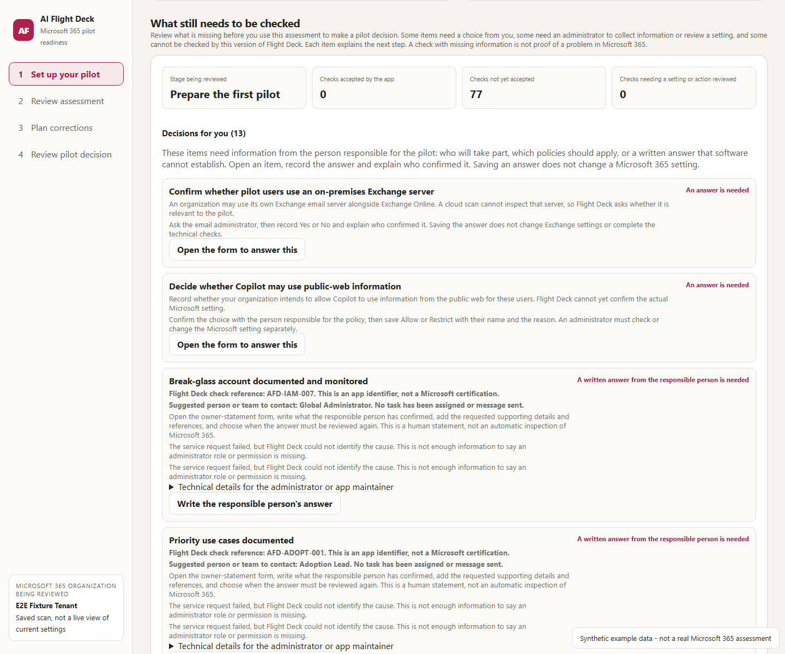

# AI Flight Deck

**A prototype for organizing Microsoft 365 Copilot pilot evidence, findings
and decisions.**

## Project vision

**Help a rollout owner move from assessment findings to an accountable,
evidence-supported pilot decision—and keep that decision current as the
environment changes.**

The ambition is a follow-through workflow around Microsoft's assessments and
other evidence sources, not a replacement collector. A mature Flight Deck would
help a team:

1. Define the users and scope of a pilot.
2. Connect relevant findings to rollout requirements and explain what is missing.
3. Route work to accountable people, track reviews and approvals, and distinguish
   tenant issues from limitations of the assessment itself.
4. Validate evidence of closure after an approved change, rather than treating
   a completed task or a successful collection as proof.
5. Revisit eligibility when evidence expires or the environment changes.

The question we want it to answer is:

> "Can this defined pilot proceed, what blocks it, who needs to act, and what
> evidence supports that decision?"

**This is the project vision, not a description of a complete capability
available today.** The current prototype implements parts of that workflow.

## What the prototype can already do

The local interface follows **Set up → Assessment → Corrections → Decision**.
These capabilities are implemented, with the boundaries shown below.

| Capability available now | What it does | Important boundary |
|---|---|---|
| Pilot selection | Searches Microsoft Entra users/groups and saves an explicitly approved membership snapshot with an owner | Bounded resolution; group results can lag recent changes. This is not continuous membership tracking |
| App-managed collection | Launches authenticated Graph and workload reads, including Exchange, SharePoint, Purview and Power Platform | Sign-in, consent and service access are still required. A successful read is not a validated readiness result |
| Grouped sharing review | Separates access-review observations from ordinary permission inventory, with 25 groups per page, 50-record drilldowns and separate CSV exports | Uses a bounded root-item sample. It is not a recursive, million-file inventory or complete effective-access assessment |
| Evidence completion | Organizes unresolved checks into user decisions, administrator actions, configuration findings and app limitations | An unknown result is not automatically a tenant fault. Suggested accountable roles are not assigned operational tasks |
| Local decisions and statements | Records pilot approval, hybrid Exchange and web-grounding choices; supports control-specific owner attestations | An owner name or local signature does not prove organizational approval authority or independently verify a tenant setting |
| Limited evidence-based gating | Checks supported evidence for binding, freshness and required data; keeps unsupported claims unresolved | Three automated licensing contracts and eleven attested contracts are implemented—not all 77 controls |
| Reassessment and comparison | Supports on-demand recollection and bounded baseline/verification comparison; expired evidence stops satisfying gates when reevaluated | Not continuous monitoring. Sharing comparison does not prove remediation across every workload |
| Microsoft report imports | Accepts readiness reports and a narrowly mapped automated-assessment recommendation CSV | Nine exact upstream check names map to three Flight Deck controls at the supported revision; other rows/revisions remain staged |

### What has been demonstrated

Synthetic integration and browser exercises cover directory selection and
approval, local decisions, cancellation, evidence handling and expiry behavior.
The grouped review has also been exercised against a saved tenant assessment.
These are useful checks of implementation, **not proof of a complete real-tenant
pilot-to-rollout lifecycle**.

## What is not yet implemented or proven

Flight Deck has **77 application-defined controls across 13 organizing domains**.
This is a policy catalogue, not 77 fully validated automated checks or a claim
of broader coverage than Microsoft's differently grouped service areas.

**Not yet implemented:** source-observation validation for the remaining
**63 controls**; an operational task-assignment, reminder and approval system;
continuous change monitoring and automatic follow-up; and a production-scale,
complete effective-access collection service. Flight Deck also does not
automatically launch Microsoft's assessment or correlate its entire output.

**Not yet proven:** an end-to-end live-tenant trial of directory selection and
approval, a real pilot progressing through the complete rollout lifecycle,
and measurable savings in coordination effort. Passing synthetic exercises or
displaying mission gates does not establish those outcomes.

Do not use this version to approve an estate-wide production rollout.

## Why use this if Microsoft already has an automated readiness assessment?

**If you only need automated tenant checks and recommendations, start with
[Microsoft's assessment](https://github.com/microsoft/m365-copilot-automated-readiness-assessment).
Flight Deck is not required for that job.**

Microsoft already provides automated collection, prioritized recommendations,
CSV/Excel reports and repeatable assessments with timestamped outputs.
Flight Deck's potential additional value is the **pilot follow-through
workflow** described in the vision—not superior collection or greater authority.

| Area | Microsoft's documented workflow | Flight Deck's implemented addition |
|---|---|---|
| Scope | Select a tenant and service areas to assess | Save a named, approved pilot membership snapshot |
| Findings | Report feature status, priority, observations and recommendations | Organize findings and app limitations within a custom control/mission interface |
| Evidence | Produce timestamped reports and support reassessment | Apply tenant/cohort binding, local integrity and expiry rules to supported evidence contracts |
| Review | Inspect assessment outputs | Browse grouped sharing evidence, record local owner decisions and prepare correction context |
| Decision | Provide readiness observations and recommendations to stakeholders | Calculate eligibility under Flight Deck's custom policy, with unsupported proof kept unresolved |

This does **not** mean Flight Deck already provides the envisioned operational
workflow end to end. Its current value is a workspace for evaluating that
approach, and for reviewing bounded evidence with its limitations visible.
If that does not improve the team's work, Microsoft's assessment with an
existing tracker is the simpler choice.

This repository also contains its own authenticated collectors. That overlaps
with Microsoft's collection work and creates maintenance cost; it is not the
differentiator. The direction is to reuse Microsoft's evidence and collection
capabilities where practical, while developing and proving the additional
workflow.

Sources: upstream [README](https://github.com/microsoft/m365-copilot-automated-readiness-assessment/blob/f542406ffba2066d943643de8d7a87b755b98cab/README.md)
and [run guide](https://github.com/microsoft/m365-copilot-automated-readiness-assessment/blob/f542406ffba2066d943643de8d7a87b755b98cab/RUN.md)
at Flight Deck's supported import revision `f542406ffba2066d943643de8d7a87b755b98cab`.
This compares documented workflows, not an exhaustive claim that an upstream
feature is absent. The revision is an integration reference, not a claim about
the latest upstream HEAD.

### Example: a DLP concern

**Today:** Flight Deck can retain a supported mapped concern, associate it with
a control, show suggested accountable-role guidance and explain why it remains
unresolved. The DLP source-validation contract is not implemented, so it cannot
declare that gate closed.

**In the envisioned workflow:** the concern would move through an assigned
owner's investigation, an approved change, fresh source evidence and validated
closure, with the pilot decision updated accordingly. That complete sequence
remains work to build and demonstrate.

## Evidence authority and supported boundaries

`collector-runtime.js` retains only source-derived proof facts and a digest before
discarding raw collector observations. It does not persist raw Graph user records,
tokens, invented request IDs, or credentials in the receipt. `evidence-authority.js`
checks those facts against the normalized decision and creates a locally
HMAC-sealed, source-bound observation receipt. Each new `evidenceRefs` entry resolves
to that receipt's record, rather than to a decorative string.

The implemented automated contracts are:

| Control | Validated observation boundary |
|---|---|
| AFD-LIC-001 | Complete Graph SKU/user enumeration, resolved approved cohort, active Copilot subscriptions, and **prepaid minus consumed** units covering the cohort, matching the catalogue criterion |
| AFD-LIC-002 | Complete Graph user enumeration, approved cohort membership, and enabled Copilot service-plan assignments with no missing members or licensed users outside the cohort; an assigned SKU alone is insufficient |
| AFD-LIC-004 | Complete, well-formed SKU/add-on inventory, with a matching normalized inventory; this does not independently prove entitlement to every downstream feature |

The automated Copilot entitlement contracts identify the
`M365_COPILOT_APPS` service plan by its documented identifier
`a62f8878-de10-42f3-b68f-6149a25ceb97`, rather than matching any product name
containing “Copilot.” This excludes Studio-only and unrelated Copilot products.
Source: Microsoft's [licensing identifier reference](https://learn.microsoft.com/en-us/entra/identity/users/licensing-service-plan-reference).
The boundary is Copilot in productivity apps; other features still require their
own applicable controls and evidence.

All eleven catalogue-designated attested controls have bounded data contracts.
An accepted statement means that the accountable signer supplied the required
facts and references, not that Flight Deck fetched those documents or independently
tested effective settings. The local HMAC protects integrity; it does not authenticate
Microsoft's truth, prove the signer's service role, or constitute external evidence.
The existing local service/adapter and host remain trust boundaries.

| Attested control | Required data (non-empty text unless stated otherwise) |
|---|---|
| AFD-IAM-007 | `accountRef`, `owner`, `exclusionEvidenceRef`, `monitoringAlertRef` |
| AFD-DEV-005 | `owner`, `policyRef`, `conditionalAccessEvidenceRef`, `enrollmentRestrictionsEvidenceRef`, `settingsMatchPolicy: true` |
| AFD-OPS-004 | `owner`, `advisoryReviewRef`, `reviewedAt` within 7 days, `catalogueUpdated: true` |
| AFD-OPS-005 | `technicalContact`, `executiveContact`, exact `tenantId`, `reviewedAt` within 30 days |
| AFD-COPILOT-006 | `owner`, `decision`, `privacyAssessmentRef`, `tenantSettingEvidenceRef`, `tenantSettingMatch: true` |
| AFD-PPA-005 | Non-empty `sources`, each with `id`, `sensitivityLabel`, `dlpAlignment`, `promptInjectionReview`; `tools` array, each with `id`, `inputBoundary`, `outputBoundary` |
| AFD-ADOPT-001 | At least three `useCases`, each with owner, exact `targetCohort`, expected outcome and success metric |
| AFD-ADOPT-002 | Non-empty `cohorts`, including the selected cohort's `id`; each has owner, `groupId`, entry and exit criteria |
| AFD-ADOPT-003 | `training.deliveredAt` within 30 days; `support` with intake, owner and response target |
| AFD-ADOPT-004 | Non-empty `publishedUseCaseIds`, each covered by a current `acceptances` record with use-case ID, champion, impact assessment URL and expiry |
| AFD-ADOPT-006 | Non-empty `reviews` within 7 days, each with `driftReviewed: true` and non-empty textual decisions |

Set up shows the exact JSON structure for the selected control. The same examples
are in `schema/attestation-data-examples.v1.json`. Replace every blank with reviewed
facts; templates are not evidence. Include at least one evidence reference and a
current signature, statement, attester, tenant, cohort, domain, control and expiry.
Adoption controls also retain their existing domain normalization checks.
Only AFD-DEV-005, AFD-PPA-005, AFD-ADOPT-002 and AFD-ADOPT-003 support an attested
`NotApplicable`: provide `applicablePopulation: 0`, `scopeEvidenceRef`, a reason and
an approver. Signing an exemption for an unconditional control cannot bypass it.
Signed Fail/Warning reports remain findings for review rather than positive proof.

For all other controls, collectors and the existing 77-control guidance remain
available, but unimplemented observation validation paths explicitly remain
`Unknown` / “App capability missing.” Administrator/Power Platform imports
and upstream CSV reports remain useful input and findings; their local seal and
challenge do not establish source truth or effective enforcement. The administrator
package contract remains exactly version **1.0.0**. Network probes remain limited to
the scanner host; inventory and sampled access are not effective-access proofs.

### Admission, freshness and reader parity

- Binding must match the trusted tenant, cohort, domain, control, instance, actor,
  catalogue version and collector run. Cross-run or cross-tenant replay is rejected.
- Coverage must use non-negative safe integers, with `population = evaluated` and
  `excluded = 0`. Exclusion approval is not implemented; an “approved” text reason
  cannot substitute for it. Empty inventory may be valid; empty cohort evidence is not.
- Evidence must be current relative to evaluation time, no more than five minutes
  in the future, and expire within the catalogue's exact freshness cap. Signed
  statements are signature-checked again on read and expire with their evidence.
- Evidence limitations cannot coexist with a conclusive observation claim.
  Confidence is retained as reported, never used to manufacture authority, and
  missing confidence is displayed as “not reported,” not 0% or 100%.
- `evidence-admissibility.js` is the single satisfaction rule for missions,
  enablement, evidence completion, decision blockers and control CSV exports.
  Admission is process-local and binds the complete result against subsequent
  mutation. Serialized `Verified`/`Accepted` markers are never sufficient.
- The local service verifies the artifact envelope **and the separate observation
  receipts** before serving results. The browser admits only responses obtained
  through that same-origin artifact API; file-imported and legacy results display
  a recollection explanation. A JSON file is not a transferable trust token.
- Mission quality includes missing controls and missing confidence. A mission
  whose own controls pass still explains any blocked predecessor.

`schema/control-result.schema.v1.json` remains backward-compatible for legacy
results without authority; newly generated authority follows the strict
`schema/evidence-authority.schema.v2.json` contract. Older artifacts are displayed
for review, not silently grandfathered into a readiness decision. Result projection
can change as evidence expires; the stored artifact envelope still identifies the
original collected artifact.

Targeted verification:

```powershell
node --test evidence-authority.test.js mission-engine.test.js enablement-playbook.test.js evidence-completion.test.js estate-collector-suite.test.js server.test.js
```

The strict schema regression uses the existing Python `jsonschema` installation.

## Microsoft tools used and credited

AI Flight Deck is an independent hackathon prototype. It is not a Microsoft
product, service, or replacement for Microsoft's readiness tooling.

It deliberately builds on evidence produced by these Microsoft resources:

| Microsoft resource | What Microsoft provides | How AI Flight Deck uses it |
|---|---|---|
| [Microsoft 365 Copilot Readiness report](https://learn.microsoft.com/en-us/microsoft-365/admin/activity-reports/microsoft-365-copilot-readiness?view=o365-worldwide) | Microsoft 365 admin-center reporting for licence assignment, eligible app update channel, recent workload usage, and suggested Copilot candidates | Imports the CSV as time-bounded cohort-planning evidence and preserves its privacy, 28-day activity-window, and reporting-latency limitations |
| [Microsoft M365 Copilot automated readiness assessment](https://github.com/microsoft/m365-copilot-automated-readiness-assessment) | Microsoft-authored open-source collection and recommendations across Microsoft 365, Entra, Defender, Purview, Power Platform, Copilot Studio, and Agent 365 | Imports its recommendation CSV, records the source revision, maps only verified exact checks, and stages unrecognized rows instead of guessing |
| [Microsoft Graph](https://learn.microsoft.com/en-us/graph/overview) | Microsoft APIs for tenant, identity, policy, device, service-health, security, collaboration, and reporting data | Performs the live delegated read-only scan |
| [Microsoft Learn](https://learn.microsoft.com/) | Authoritative product documentation and configuration guidance | Links every readiness control and correction back to relevant Microsoft documentation |

Microsoft's open-source readiness assessment is licensed under the MIT
License by its authors. AI Flight Deck currently consumes its exported report;
it does not copy or redistribute the upstream source code. See
[`ACKNOWLEDGEMENTS.md`](ACKNOWLEDGEMENTS.md) for attribution and integration
details.

## Implemented prototype components

These components support the project vision within the limits described above.
Their presence does not establish a complete operational rollout workflow.

| AI Flight Deck capability | What it offers |
|---|---|
| Cross-source evidence control tower | Combines Microsoft reports, a live Graph scan, workload evidence, and accountable attestations without hiding their source |
| Named pilot cohort | Searches live Microsoft Entra users or groups and saves an explicitly approved, bounded membership snapshot with an accountable owner; no CSV is required |
| 13 domains and 77 controls | Normalizes licensing, identity, devices, network, service health, Exchange, Teams, SharePoint/OneDrive, Purview, security, Copilot configuration, Power Platform/agents, and adoption/governance |
| Actionable evidence gaps | Preserves the actual source error; an unsupported command, unknown failure, or missing validation contract is not automatically a missing permission |
| Evidence completion center | Separates decisions, administrator actions, configuration findings and app limitations, with five items initially displayed per category and links to the appropriate form or control definition |
| Mission gates | Shows whether activation, safe pilot, scale, and assurance missions can advance and identifies the exact blocking controls |
| Readiness-impact traces | Connects evidence source to control, affected mission, decision impact, and required correction when a full access graph is unavailable |
| SharePoint access and sharing review | Converts public SharePoint sites and sampled Anyone or organization-wide sharing links into named, evidence-backed validation scenarios with bounded audience estimates, explicit limitations, and administrator actions |
| Tenant-wide enablement plan | Computes a recommendation under custom policy and lists suggested accountable roles, administration paths, checklists, acceptance criteria and Microsoft references. Missing validation contracts prevent an estate-wide approval |
| Evidence-bound corrections | Produces administrator action packages tied to the selected controls and signed baseline rather than claiming that changes were applied |
| Bounded before-and-after comparison | Compares collected sharing baselines and verification results. This does not prove remediation across all 77 controls |
| Provenance and freshness | Retains source artifact hashes, report dates, collector identity, evidence limitations, and conflicts between imported and live evidence |
| Detailed exports | Exports the complete control-level assessment and correction context for review outside the application |

In one sentence: **Flight Deck implements parts of a pilot evidence-and-decision
workspace; the complete follow-through workflow is the vision still to prove.**

### Using the control instructions

Select **View required action** or **View control definition** on a Set up item to open and
focus that control in the Decision page's plan, including when the previous filter
would have hidden it. Every control includes its affected identifiers (when
recorded), prerequisites, owner, two control-specific inspection/treatment
steps, acceptance criterion, evidence collection instructions, and collection
boundary. The same instructions and policy/source qualifications are included
in the downloadable plan and control CSV.

The 77-control catalogue is **AI Flight Deck rollout policy**, not an official
Microsoft certification or universal prerequisite list. Linked Microsoft pages
are supporting documentation; the application does not assert their live
currency or that they mandate every custom threshold. Entitlement prerequisites
are not displayed as missing licences simply because no complete entitlement
inventory is available. In the completion API, omitted/null `availableLicenses`
means unknown; an explicit array is the caller's complete normalized inventory.

**Evidence integration required** means the production pipeline still lacks an
input used by the evaluator, such as effective Teams policy assignments.
Repeated rescans, additional consent, or an unrelated attestation do not supply
that input. The app now launches authenticated workload collectors and ingests
their results itself; operators do not assemble export packages. Owner approvals
and local package seals still do not prove effective permissions or complete
workload coverage.

Administrator packages retain their version 1.0.0 contract. The consumer accepts
command-only entries produced by the shipped script only when the command has
one purpose in that workload's query plan. Exact entries and exact errors take
precedence. Multi-purpose commands such as `Get-SPOSite`,
`Get-SPODataAccessGovernanceInsight` and `Get-AutoSensitivityLabelPolicy` still
require the purpose-specific key. Collection requests now carry the scan tenant
ID into package validation.

## How the SharePoint access and sharing review works

**Export review summary (CSV)** downloads `ai-flight-deck-sharing-review.csv`
with one row per review or inventory group. **Export collected evidence (CSV)**
downloads the individual collected records separately. Evidence references are
attached to their own rows, not repeated as an entire finding's ID list on every
row. Both support UTF-8, quoted multiline text and spreadsheet formula protection.
Machine-readable remediation bindings and verification artifacts remain JSON.

The default view groups access patterns by site, library and known permission
origin. Ordinary user/group grants remain **Permission inventory**, not automatic
remediation tasks. Inherited access is labelled inherited; missing origin
metadata remains explicitly unresolved rather than being assigned a guessed
parent. Public Microsoft 365 groups require access validation, not an automatic
claim of sensitive-content exposure.

The view displays 25 groups per page and at most 50 evidence records in a
drilldown. Counts distinguish sampled items from permission records. This bounds
the rendered interface, not the entire collection architecture: the existing
bounded, root-level scan artifact still loads locally into the browser. It is
not a recursive million-file inventory or server-side paginated data service.

The Assessment page does not treat every sharing signal as confirmed sensitive
data exposure. It separates four questions:

1. **What resource was observed?** A public SharePoint site, sampled file,
   sampled folder, or sharing link.
2. **Why was it selected?** The site is connected to a public Microsoft 365
   group, or the sampled item has an Anyone or organization-wide sharing scope.
3. **Who might be able to use the path?** The product reports a bounded
   potential audience, not a fabricated exact affected-user count.
4. **What must the administrator do?** Confirm ownership and business need,
   inspect permissions and content, restrict unnecessary access, and rescan.

The live review currently produces these evidence-backed scenario types:

| Scenario | What the scan proves | Audience treatment | Required review |
|---|---|---|---|
| Public SharePoint site | Its connected Microsoft 365 group is Public | Up to the enabled member-account population inventoried by the scan | Confirm public visibility, site owners, permissions, sharing links, and content |
| Anyone link on a sampled item | Anonymous link scope exists on the sampled file or folder | Unbounded because recipients are not identifiable | Remove the link unless unauthenticated access is explicitly approved |
| Organization-wide link on a sampled item | Organization link scope exists on the sampled file or folder | Up to the enabled member-account population inventoried by the scan | Replace broad link access with named people or groups when it is unnecessary |
| Specific-people link | A bounded permission detail names the link recipient set | Named principals observed on the permission | Validate recipients, role, expiry, and continued business need |
| Direct user or guest grant | A sampled item permission names user or guest principals | Directly named principals only | Confirm sponsorship and business need; remove stale access |
| Direct group grant | A sampled item permission names a group or SharePoint site group | Group principals are known; nested members are not expanded | Review group ownership and membership before relying on the audience estimate |
| Application or agent grant | A sampled item permission names an application principal | Application principals observed on the permission | Validate workload identity, resource scope, and agent governance |
| Inherited permission | The sampled item reports inheritance from a parent resource | Complete downstream audience is not expanded | Review the parent permission and break or narrow inheritance when necessary |
| Guest identity context | Guest accounts exist in the bounded directory inventory | No resource-level claim is made | Review sponsorship, lifecycle, group membership, and external sharing |
| Collection boundary | Root-level sampling does not recursively inspect every nested item or effective permission | Not calculated | Complete deeper SharePoint governance evidence for priority sites |

**Potential audience is not the same as affected users.** For example, a
public site can create a tenant-wide potential audience, while an Anyone link
has an unbounded audience. An exact affected-user count would require
resource-by-resource effective-permission evaluation, nested group expansion,
guest mapping, inherited permissions, and link-use context. AI Flight Deck
shows the supported upper bound and the missing evidence instead of presenting
an unsupported precise number.

For sampled root items that Microsoft Graph marks as shared, the scanner also
performs a bounded, best-effort permission-detail pass. This can distinguish
specific-people links, direct user, guest, group, application or agent grants,
and inherited permissions. It records roles and expiration when Graph returns
them. It does not recursively enumerate every item or expand nested group
membership.

The scanner reads metadata and permissions only. It does not retrieve document
contents, and therefore does not claim that a flagged resource contains
sensitive information. A scenario identifies a sharing configuration that
requires validation before rollout; it is not proof of a Copilot data leak.

The Decision page also provides a complete customer handoff for tenant-wide
enablement. Customers can filter remaining requirements in the application or
download a Markdown plan covering licensing, Entra ID, devices, network,
service health, Exchange, Teams, SharePoint and OneDrive, Purview, Defender,
Copilot configuration, Power Platform and agents, and adoption governance.
Every control identifies the responsible roles, administration portal and
navigation path, ordered implementation procedure, validation condition, and
relevant authoritative Microsoft documentation.

## See the product before installing

[Open the complete AI Flight Deck visual tour](docs/VISUAL-TOUR.md) to see
all four workflow stages, what each provides, and how evidence moves from
collection to a cohort-specific decision.

[](docs/VISUAL-TOUR.md)

The screenshots use an isolated, explicitly labelled synthetic offline fixture
data. They do not contain tenant data and are intended to show the product
experience before a live scan is connected.

## Install AI Flight Deck on a Windows computer

AI Flight Deck is a local Windows application. It runs a web interface on
`127.0.0.1` and does not require Azure hosting, a database, `npm install`, or a
web-server setup.

### Simplest first-time setup

1. Download the repository ZIP from GitHub.
2. Extract the entire ZIP to a normal local folder.
3. Double-click:

   ```text
   SETUP-AI-Flight-Deck.cmd
   ```

The guided setup checks that all application files are present, checks the
Node.js version, offers to install Node.js LTS through Windows Package Manager
when necessary, installs `Microsoft.Graph.Authentication` for the current
Windows user, checks port `8080`, offers to create a desktop shortcut, and
starts AI Flight Deck.

The setup asks before installing prerequisites. It does not connect to or
change a Microsoft 365 tenant. Tenant sign-in starts only after the user selects
**Connect and scan tenant** inside the application.

### Requirements

Before downloading the repository, confirm that the computer has:

- Windows 10 or Windows 11.
- Permission to run PowerShell.
- Microsoft Edge, Google Chrome, or another current browser.
- Network access to Microsoft sign-in, Microsoft Graph, and Microsoft 365.
- A Microsoft 365 test-tenant account approved to grant or request the
  displayed read-only permissions.

The guided setup can install
[Node.js 18 or later](https://nodejs.org/en/download) when Windows Package
Manager is available. Git is optional and is needed only when installing with
`git clone`.

### Manual fallback: install Node.js

Use this only if the guided setup cannot install Node.js. Download and install
the current Node.js LTS release:

```text
https://nodejs.org/en/download
```

Keep the installer option that adds Node.js to `PATH`. Close and reopen
Command Prompt after installation, then confirm:

```powershell
node --version
```

The command must print version 18 or later. No Node packages need to be
installed for AI Flight Deck.

### Download AI Flight Deck

Choose either method.

#### Option A - Download the ZIP

1. Open
   [sethiramicrosoft/ai-flight-deck](https://github.com/sethiramicrosoft/ai-flight-deck).
2. Sign in to GitHub with an account that has access to the repository.
3. Select **Code**, then **Download ZIP**.
4. Extract the ZIP to a normal local folder, for example:

   ```text
   C:\Tools\ai-flight-deck
   ```

5. Do not run the launcher from inside the compressed ZIP preview.

#### Option B - Clone with Git

Open PowerShell and run:

```powershell
cd C:\Tools
git clone https://github.com/sethiramicrosoft/ai-flight-deck.git
cd .\ai-flight-deck
```

Because the repository is private, GitHub may ask the user to authenticate.

### Start after setup

For later sessions, open the extracted or cloned `ai-flight-deck` folder and
double-click:

```text
Start-AI-Flight-Deck.cmd
```

Alternatively, start it from PowerShell:

```powershell
cd C:\Tools\ai-flight-deck
.\Start-AI-Flight-Deck.cmd
```

The launcher:

1. Checks that `node.exe` is available.
2. Starts the localhost control plane on port `8080`.
3. Opens the following page in the default browser:

   ```text
   http://127.0.0.1:8080/index.html
   ```

Keep the launcher window open while using the application. Closing that window
stops the local service.

### Complete the first live scan

1. On **Set up**, select **Connect and scan tenant**.
2. If required, Flight Deck installs the
   `Microsoft.Graph.Authentication` PowerShell module for the current Windows
   user. PowerShell Gallery may ask whether it can install or trust supporting
   components.
3. The browser opens `https://microsoft.com/devicelogin`.
4. Copy the one-time code displayed in Flight Deck.
5. Enter the code on Microsoft's sign-in page.
6. Sign in with the approved Microsoft 365 tenant account.
7. Review the requested delegated permissions. Graph requests read access.
   Workload connectors use Microsoft's administration clients; their consent
   can be broader than the read-only commands this tool executes.
8. If tenant-wide admin consent is required, ask an authorized administrator
   to approve the displayed permissions.
9. Return to Flight Deck and leave the launcher window open until the scan
   finishes.
10. Flight Deck opens **Assessment** automatically when the baseline is ready.

The first run may take longer because missing Microsoft authentication and
administration modules are installed for the current Windows user.

### Complete evidence the Graph scan cannot collect

**Connect and scan tenant** now runs Graph and the four workload collections
automatically. **Collect workload evidence** updates an existing verified
baseline without repeating its SharePoint sharing inventory. Complete each
Microsoft service's sign-in, MFA, or consent prompt when requested; the app
handles prerequisites, execution, temporary output, local ingestion and
assessment refresh. There are no required script downloads, administrator
exports, copied collection challenges or hand-filled workload JSON templates.

Per-workload outcomes remain visible in Set up and are saved with the assessment.
One service's role denial or missing module does not prevent other services from
being attempted. Each workload has a 15-minute deadline and collection can be
cancelled. Producer output is limited to 12 MB per workload; over-limit output
is an explicit gap, not silently truncated evidence. The default scan attempts
all four workloads. Availability still
depends on tenant licensing, roles, service support and local installation policy.

#### Exchange Online, SharePoint Online, and Purview

The app launches `scanner/collect-admin-evidence.ps1` once per service, using
`ExchangeOnlineManagement` or `Microsoft.Online.SharePoint.PowerShell`. It
discovers the commercial SharePoint administration URL through the Graph
organization and root site, bound to the baseline tenant. It never passes the
Graph access token to a workload connector.

Producer output must match the current collection challenge, expected tenant,
supported producer/version and freshness contract. A workload cannot supply
another service's command keys. The app combines only the current run's admin
outputs, retains collection errors and per-service identity/timestamps, and
protects the result with the local workspace integrity key. An unsuccessful
current collection cannot silently substitute a previous successful result.

The schema stays at 1.0.0; the automated administrator producer is 1.1.0.
Command boundaries, counts, module versions and cleanup failures are retained.
Automatic installation includes `AllowClobber` for the allowlisted Microsoft
modules and their package-management dependencies, which can overlap Windows'
inbox `Find-Package`, `Install-Package` and `Uninstall-Package` commands.
Connector failures supply safe structured diagnostics to the workload status
instead of only a PowerShell exit code.
When every command fails, the collector still fails without admitting an
evidence package, but retains bounded per-command error details in the workload
panel and saved collection outcome. Authentication and command diagnostics use
fixed explanations and safe error codes, not raw service exceptions or tokens.
An unclassified connection failure is not automatically labelled a user cancellation.
If `Get-HybridConfiguration` is unavailable, the collector identifies its
[on-premises-only scope](https://learn.microsoft.com/powershell/module/exchangepowershell/get-hybridconfiguration)
rather than implying an Exchange Online role change will expose it. This does
not establish that hybrid configuration is absent or not applicable.

Warning-bearing rows are retained in a separate `observations` map, never
silently promoted to accepted source evidence. The workload panel separates
acquisition outcome, accepted rows, retained observations, and coverage gaps.
An observations-only run can be partial rather than discarding useful rows;
a genuinely empty, unsuccessful acquisition still fails.

`Get-SPOSite` no longer uses deprecated `-Detailed`. Each inventory scope is
bounded to 1,000 rows, followed by identity-specific detail reads because list
queries can omit or default configuration properties. The process-wide detail
budget defaults to 200 sites, with caching across the three logical site queries.
Unhydrated or warning-bearing rows stay observations, not configuration proof.
These counts are per query and must not be summed as unique sites.

The Purview audit-log query now uses a supplemental Exchange Online connection
after IPPS policy collection. Its tenant and actor must match before the bounded
audit read runs. An audit connection failure does not discard successfully
collected Purview policy evidence. This fixes the session routing; it does not
prove that every tenant exposes the command or that audit ingestion is healthy.

SharePoint Data Access Governance reads use
[documented report entities](https://learn.microsoft.com/powershell/module/microsoft.online.sharepoint.powershell/get-spodataaccessgovernanceinsight) and
`Snapshot` / `RecentActivity` report types. They read existing report metadata,
not report contents: the site-access query targets SharePoint permissions
snapshots, and the governance query targets recent Everyone-except-external-users
item reports. Neither query establishes complete site permissions or all forms
of oversharing, and neither creates a report.

Windows PowerShell child processes initialize their native module search paths;
they do not inherit PowerShell 7's module directories. This allows discovery of
CurrentUser installations, including redirected Documents folders.
Exchange and Purview bind the service's reported tenant and signed-in account.
SharePoint's administration module does not expose those identities: they remain
null and `tenantVerified` remains false. Its connected administration URL must
match the Graph-derived target. The aggregate does not invent a common service
actor. Neither this URL binding nor local integrity sealing proves effective
tenant-wide access.

#### Power Platform and Copilot Studio

The app launches `scanner/collect-power-platform-evidence.ps1` with the baseline
tenant and ingests its authenticated output automatically. The package retains
the original seven-resource contract: environments, DLP policies, connectors,
agents, agent owners, sharing and lifecycle. It also collects app, flow and
connection inventories independently of Dataverse. Unsupported or inaccessible resources
receive explicit errors instead of fabricated approval flags or empty-array
claims of complete coverage.

The supported path uses the pinned Microsoft PowerApps administration module
for environments, legacy DLP policies, custom connectors, apps, flows and
connections across the accessible environments, then each
accessible environment's Dataverse Web API for bots, record owners, explicit
shares and lifecycle metadata. It checks resource-specific token tenant/actor
bindings, validates Dataverse hosts and pagination links, and bounds collection
to 50 environments, 2,000 rows per resource, 500 explicit operations and 20 pages
per query by default. Administration-module pagination is opaque and its
internal HTTP request count is not asserted. Standard connector coverage,
effective role/team/inherited sharing, business approvals and tenant-wide
visibility are not proven. These boundaries stay explicit even when rows are
successfully returned.

When list metadata is insufficient, the collector reads details for that exact
environment and revalidates its authenticated context before accepting a
Dataverse endpoint. It never guesses a URL. A missing endpoint means database
availability is unknown, not that Dataverse does not exist: the module's
`CommonDataServiceDatabaseProvisioningState` label reflects generic environment
provisioning, not database existence.

Each dataset records a read outcome: collected, partial, failed or unavailable.
A successful empty read is distinct from a denied request. The workload panel
separates collection errors from coverage and review gaps; legacy packages
without recorded acquisition status remain explicitly labelled. The pinned
module's REST failure propagation is enabled temporarily and restored after
each read so a swallowed HTTP error cannot masquerade as a successful empty list.
App/flow definitions, connection credentials and connection strings are excluded.

These collection choices build on the separate non-Dataverse service paths in
[Microsoft's reference collector](https://github.com/microsoft/m365-copilot-automated-readiness-assessment/blob/f542406ffba2066d943643de8d7a87b755b98cab/Core/get_power_platform_client.py).
Unlike its selected-environment approach, this collector visits accessible
environments within explicit bounds. It does not adopt empty-on-error fallbacks
or infer bot coverage from app/flow inventory. These extra inventories are
observations; they do not add authority contracts or automatically clear controls.

Workload scripts run under Windows PowerShell 5.1, independently of the Graph
scanner's preferred PowerShell host. Execution-policy bypass is process-local;
the app does not change persisted policy or override organization-enforced
restrictions.

Successful collection is **not** automatic authority admission. The bounded
validator still admits only the source contracts listed above. Missing
observation-validation paths remain Unknown; authenticating or resealing data
does not implement those contracts.

Existing offline import controls remain in a collapsed **Advanced: import an
existing evidence package (optional)** section. They are not part of the normal
collection flow; their one-time challenge and freshness rules remain enforced.

#### Accountable governance attestations

For controls whose catalogue automation class is `Attested`, load a locally
verified baseline for an explicitly approved cohort, then complete the
attestation form in the Evidence completion center. Flight Deck:

1. Restricts attestations to controls explicitly marked `Attested`.
2. Derives the attester from the verified scan actor and binds the statement
   to that identity, the verified tenant, approved cohort, control, supporting
   data, and evidence references. A different attester must authenticate and
   produce the verified scan used for the statement.
3. Caps expiry to the control's catalogue freshness window.
4. Seals the record with the local workspace integrity key.
5. Verifies the signature during the next scan before the record can affect a
   control result.

`NotApplicable` attestations additionally require a named approver, reason, and
future expiry. Missing expiry or incomplete control coverage cannot satisfy a
mission gate.

## Permissions required

There are two different permission sets: permissions on the Windows computer
and permissions in the Microsoft 365 tenant.

### Windows computer permissions

The person installing the prototype needs permission to:

- Extract files to a local folder.
- Run `.cmd` and PowerShell scripts.
- Install Node.js if it is not already present. Windows may display an
  elevation prompt depending on the device policy and Node.js installer.
- Install the `Microsoft.Graph.Authentication` module with
  `-Scope CurrentUser`. This normally does not require local administrator
  rights.
- Open a localhost listener on `127.0.0.1:8080`.
- Create a desktop shortcut if that option is selected.

If software installation, PowerShell Gallery, Windows Package Manager, or
script execution is controlled by the organization, IT must approve or perform
those prerequisite steps.

### Microsoft 365 account requirements

Use a dedicated test-tenant assessment account where possible. The account
must:

- Be a member of the Microsoft 365 tenant being assessed.
- Be allowed to complete Microsoft device-code sign-in.
- Be allowed to request or use the delegated Microsoft Graph permissions below.
- Have sufficient directory or workload roles to read the requested data.
- Have access to the licensed services being assessed.

The application uses the Microsoft Graph Command Line Tools client for
interactive delegated authentication. It does not ask the user to create an app
registration for the local prototype.

An administrator may need to grant consent before the account can use
organization-wide delegated permissions. Consent allows the application to
request a scope; the signed-in user's own role and service access still limit
what the scan can read.

### Delegated permissions requested by the live scanner

The localhost scanner currently requests these exact Microsoft Graph delegated
scopes from `server.js`:

| Evidence area | Requested delegated scopes |
|---|---|
| Sign-in session | `openid`, `profile`, `offline_access` |
| Tenant and directory inventory | `Organization.Read.All`, `Directory.Read.All`, `User.Read.All`, `Group.Read.All`, `Application.Read.All` |
| Identity governance and access | `AccessReview.Read.All`, `AuditLog.Read.All`, `Policy.Read.All`, `IdentityRiskyUser.Read.All`, `RoleManagement.Read.Directory`, `UserAuthenticationMethod.Read.All` |
| Devices and Microsoft 365 Apps | `DeviceManagementApps.Read.All`, `DeviceManagementConfiguration.Read.All`, `DeviceManagementManagedDevices.Read.All`, `DeviceManagementServiceConfig.Read.All`, `OrgSettings-Microsoft365Install.Read.All` |
| Service health and operations | `ServiceHealth.Read.All`, `ServiceMessage.Read.All` |
| Teams, apps, and collaboration inventory | `Team.ReadBasic.All`, `Channel.ReadBasic.All`, `AppCatalog.Read.All` |
| SharePoint, OneDrive, Search, and connectors | `Sites.Read.All`, `SharePointTenantSettings.Read.All`, `ExternalConnection.Read.All` |
| Security evidence | `SecurityAlert.Read.All`, `SecurityEvents.Read.All`, `SecurityIncident.Read.All`, `ThreatIndicators.Read.All` |
| Information protection | `InformationProtectionPolicy.Read` |
| Usage evidence | `Reports.Read.All` |

All requested Microsoft Graph data permissions are read scopes. The scanner
does not request Graph write permissions.

The list above is the source of truth for the current local sign-in flow. If
the code changes, review `GRAPH_SCOPE_LIST` in `server.js` before approving a
new consent request.

### Roles used across the 13 readiness domains

No single role makes every one of the 77 controls technically available.
Microsoft Graph, workload administration, licensing, and human governance
evidence have different access boundaries.

The capability plan identifies these roles for the relevant domain:

| Readiness area | Relevant reader or administrator role |
|---|---|
| Licensing and entitlement | License Administrator |
| Identity and access | Global Reader |
| Devices and Microsoft 365 Apps | Intune Administrator |
| Network checks | Network Administrator or approved network operator |
| Service health | Service Support Administrator |
| Exchange Online | Exchange Administrator |
| Microsoft Teams | Teams Administrator |
| SharePoint and OneDrive | SharePoint Administrator |
| Microsoft Purview | Compliance Administrator |
| Microsoft Defender and security | Security Reader |
| Copilot tenant configuration | Global Reader |
| Power Platform and Copilot Studio | Power Platform Administrator |
| Adoption and organizational governance | Named business owner or signed attester |

These roles describe who can provide complete evidence; they are not permission
to make changes through AI Flight Deck. The current application remains
read-only.

If the signed-in account lacks a required role, permission, licence, connector,
or attestation, the affected control remains technically `Unknown` in the
evidence contract. The customer interface translates that state into the exact
next evidence action. That is expected behavior and does not mean the
installation failed.

### Optional Microsoft report imports

The live scan remains available at all times. To supplement it:

- Select **Import Microsoft readiness** to load the CSV exported from the
  Microsoft 365 admin center.
- Select **Import Microsoft assessment** to load the recommendation CSV from
  Microsoft's open-source automated readiness assessment.

Enter the report's real as-of date before importing it. Flight Deck deliberately
keeps evidence without a source date non-gating.

### Stop and restart

To stop AI Flight Deck, close the launcher window or press `Ctrl+C` in it.

To restart, double-click `Start-AI-Flight-Deck.cmd` again. Previous local
artifacts remain available because they are stored outside the repository at:

```text
%LOCALAPPDATA%\AI Flight Deck\live-test
```

This folder can contain tenant metadata and should be protected according to
the organization's data-handling requirements.

### Update an existing installation

For a Git installation:

```powershell
cd C:\Tools\ai-flight-deck
git pull origin main
```

For a ZIP installation, download the latest ZIP and extract it to a new folder.
Do not copy the local evidence workspace into the repository.

### Installation troubleshooting

| Problem | Resolution |
|---|---|
| Guided setup stops on Node.js | Allow the Windows Package Manager installation, or install Node.js LTS manually, reopen setup, and confirm `node --version`. |
| Windows blocks the downloaded setup file | Open file **Properties**, select **Unblock** if shown, then run `SETUP-AI-Flight-Deck.cmd` again. Follow organizational security policy. |
| The browser does not open | Manually open `http://127.0.0.1:8080/index.html`. |
| Port `8080` is already in use | Close the other AI Flight Deck launcher or process using that port, then start again. |
| Microsoft Graph module installation fails | Open PowerShell as the same Windows user and run `Install-Module Microsoft.Graph.Authentication -Scope CurrentUser`, then restart Flight Deck. |
| PowerShell Gallery asks to install NuGet or trust PSGallery | Review and accept the prompt if allowed by organizational policy. |
| Device sign-in requires approval | Ask a tenant administrator to grant the displayed delegated read permissions. |
| The page says the integrated scanner is unavailable | Start the product with `Start-AI-Flight-Deck.cmd`; do not open `index.html` directly or use a generic static server. |
| Many controls remain `Unknown` | The installation is working. Those controls require additional workload connectors, permissions, Microsoft reports, or accountable attestations. |
| A named cohort cannot be created | The Microsoft readiness export contains concealed or mixed identities. Change the Microsoft 365 report privacy setting or use an identified export. |

## Quick start for returning users

Double-click:

```text
Start-AI-Flight-Deck.cmd
```

The launcher starts the localhost-only control plane and opens
`http://127.0.0.1:8080/index.html`. From the Set up page, select
**Connect and scan tenant**. The product prepares the Microsoft Graph
authentication connector if needed, opens Microsoft sign-in, runs the
read-only baseline, stores evidence in the protected user-local workspace, and
loads Assessment automatically.

Do not host `index.html` with a generic static server when using the integrated
scanner. Static hosting supports demonstration and manual imports only.

## Scan a test tenant

The test-tenant integration uses an interactive Microsoft Graph sign-in and
delegated, read-only permissions. Credentials and tokens are never stored in the
HTML application.

### 1. Connect and scan

Select **Connect and scan tenant** inside AI Flight Deck. On first use, the
local control plane installs `Microsoft.Graph.Authentication` for the current
Windows user if it is missing.

Microsoft Graph opens a device sign-in and requests delegated, read-only
permissions for the enabled Graph collectors. The exact list is maintained in
`server.js` as `GRAPH_SCOPE_LIST` and includes directory, policy, device
management, service health, collaboration, reporting, security, SharePoint,
and information-protection reads.

An administrator may need to grant consent in the test tenant. The scanner does
not request write permissions.

Authentication modes are `Interactive`, `DeviceCode`, `ExistingContext`,
`ManagedIdentity`, and `Certificate`. Interactive delegated authentication is
the default. Certificate authentication requires `TenantId`, `ClientId`, and
`CertificateThumbprint`; the thumbprint is used only for the current command
and is not persisted in the locked configuration. The scan records the
authentication mode and actor so verification cannot compare evidence gathered
under a different identity.

The live-test runner stores tenant evidence outside the repository by default:

```text
%LOCALAPPDATA%\AI Flight Deck\live-test
```

It prints the resolved workspace path and locks collection settings in
`test-config.json`. This prevents verification from silently using different
limits, authentication mode, or scope. Use `-WorkspacePath` only when an
approved protected location is required.

### 2. Review the assessment

After sign-in and collection complete, the product loads the baseline
automatically. Assessment renders thirteen estate systems in an interactive
three-dimensional mission map. Each system remains evidence-backed as
**Online** (collected), **Degraded** (partial), or **Unscanned** (not collected),
then presents the bounded sharing signal and its evidence. It does not
substitute total directory population for affected users or present the sharing
signal as a rollout recommendation.

Manual **Import existing scan** remains available for offline evidence review.

### Combine Microsoft evidence

The Set up page supports three complementary evidence paths:

1. **Fast path - Microsoft 365 Copilot Readiness CSV.** Export the readiness
   report from the Microsoft 365 admin center, enter its displayed as-of date,
   and import it. Flight Deck records the source digest, 28-day activity scope,
   reporting privacy mode, licence assignment, update-channel observations, and
   suggested candidates. Activity-limited report rows never prove complete
   tenant or device coverage.
2. **Microsoft assessment path.** Run Microsoft's
   `m365-copilot-automated-readiness-assessment`, then import its
   `m365_recommendations_*.csv` file with the source commit or release and the
   assessment date. Flight Deck maps only exact checks verified against that
   source version. Unrecognized feature rows remain visible in a staged inbox;
   title similarity is never treated as evidence.
3. **Live path.** Run **Connect and scan tenant** to collect current Graph and
   network evidence. Fresh conclusive live evidence takes precedence if an
   imported result conflicts with it.

For identified readiness reports, select users in the candidate list, enter a
cohort name and accountable owner, and save the approved cohort. Run the live
scan again so Flight Deck can resolve every selected user to a Microsoft Graph
identity. The saved cohort is not approved for mission gating if any selected
identity cannot be resolved. Microsoft Graph paging is followed beyond the
first 999 directory users.

If the Microsoft 365 reporting privacy setting conceals any identities, Flight
Deck labels the import `Concealed` or `Mixed` and blocks named cohort creation.
If an as-of date is missing, imported results remain `Unknown` with
`MISSING_SOURCE_TIMESTAMP`.

### Current scanner scope

The collector suite is deliberately bounded:

- Registers one executable collector owner for every catalogue control and
  always emits exactly 77 normalized control results.
- Reads organization, subscribed SKU, service-plan, user, guest, group,
  Conditional Access, identity risk, Intune, service health, Teams, connector,
  application, site, drive, and root-level item metadata where Graph exposes
  the required evidence.
- Runs deterministic DNS, HTTPS, TLS, reachability, and latency probes from the
  scanner host.
- Detects anonymous and organization-wide item sharing scopes plus SharePoint
  sites connected to public Microsoft 365 groups.
- For sampled root items that Graph marks as shared, performs a separately
  bounded, best-effort drive-item permission pass to classify specific-people
  links, direct user, guest, group, application or agent grants, roles,
  inheritance, and expiration metadata.
- Does not call the Graph site ACL endpoint because Microsoft requires the
  write-capable `Sites.FullControl.All` permission even for that GET request.
- Deterministically selects sites by stable site identifier and samples
  root-level drive items.
- Does not recursively enumerate every nested item or expand nested group
  membership; those limitations remain visible in the access review.
- Reports discovered, selected, and scanned site coverage explicitly.
- Counts only risk-qualified sampled items as exposed evidence.
- Bounds users, groups, sites, drives, items, and total Graph requests.
- Retries Graph throttling and transient 502, 503, and 504 responses using
  `Retry-After`, exponential backoff, and jitter.
- Does not retrieve document contents.
- Does not change tenant configuration.
- Returns explicit `Unknown` results when a workload-specific administration
  session, service token, approved cohort, or signed attestation is required.
- Supports local administrative evidence, Power Platform evidence, and signed
  attestation adapter inputs without presenting absent inputs as completed
  checks.

Before sign-in, the local service exposes a thirteen-service capability plan
that lists the minimum permissions, administrator roles, licences, and
endpoints required by each collector. Delegated local operation and production
application identity are planned separately. Access tokens remain in memory,
are bound to one tenant/job/collector tuple through opaque one-time handles,
and are cleared on completion or cancellation.

Every scan carries a versioned producer, scoring policy, policy hash,
configuration hash, scope fingerprint, collection status, and stable evidence
identifiers. It also emits one normalized, cohort-aware result for every
catalogue control. Missing collector capabilities are explicitly `Unknown` and
block mission progression. Reaching a configured collection bound marks
required evidence as incomplete rather than presenting a smaller sample as
improvement.

Local workflow artifacts are sealed with a workspace HMAC envelope before being
served to the browser. The service rejects modified artifacts, binds generated
action packages to the signed baseline digest and selected evidence or control
IDs, and maintains an append-only digest chain for each control result. The
32-byte signing key is stored in the protected user-local workspace so sealed
artifacts remain verifiable after the local service restarts.

When a sealed, minimized evidence graph is available, the simulator performs a
deterministic access-path traversal:

```text
Principal -> Membership -> Resource -> Content signal -> AI surface -> Policy
```

It reports reachable resources, affected principals, policy blockers,
confidence, and missing graph edges. When that graph is unavailable, the
experience switches to a readiness-impact trace built from the actual failed,
warning, and unknown control results. The trace shows
`Evidence source -> Control -> Mission gate -> Decision impact` and the required
correction instead of displaying a dead-end simulator error. Neither mode sends
prompts to Copilot, uses an LLM to decide access, infers missing evidence, or
executes remediation.

The product keeps the overall status at `InsufficientEvidence` until all
mandatory domains have sufficient, current evidence.

### Estate-readiness domains

| Domain | Current state |
|---|---|
| Licensing and tenant entitlement | Automated Graph inventory plus cohort and renewal evidence |
| Identity and access | Automated Graph policy, sign-in, risk, role, and directory checks |
| Devices and Microsoft 365 Apps | Automated Intune and application checks plus policy evidence |
| Network and client connectivity | Automated local probes plus enterprise network evidence |
| Service health and tenant operations | Automated Graph issues and messages plus ownership evidence |
| Exchange Online readiness | Workload administration adapter required |
| Teams readiness | Automated inventory plus Teams policy administration evidence |
| SharePoint and OneDrive content governance | Graph scan plus SharePoint administration evidence |
| Purview information protection and compliance | Graph label read plus Purview administration evidence |
| Security posture | Graph security reads plus Defender service connections |
| Copilot configuration and feature governance | Graph inventory plus tenant policy evidence |
| Power Platform, Copilot Studio and agents | Power Platform administration evidence required |
| Adoption, measurement and operational governance | Usage reports and signed attestations required |

## Relationship to Microsoft's open-source readiness accelerator

Microsoft publishes the
[`m365-copilot-automated-readiness-assessment`](https://github.com/microsoft/m365-copilot-automated-readiness-assessment)
repository under the Microsoft GitHub organization. It is Microsoft-authored
open-source software released under the MIT License, but it should not be
represented as a supported Microsoft 365 product or service.

The current import crosswalk is pinned to upstream commit
`f542406ffba2066d943643de8d7a87b755b98cab`. That revision exports the columns
`Service`, `Feature`, `Status`, `Priority`, `Observation`, `Recommendation`,
`LinkText`, and `LinkUrl`. Flight Deck does not trust the upstream `Status`
field alone because some recommendation modules use `Success` for a completed
collector even when the observation identifies a governance gap. Exact feature
semantics and source provenance determine the proposed Flight Deck result.

AI Flight Deck can include equivalent assessment domains without losing its
product differentiation:

| Assessment domain | AI Flight Deck treatment |
|---|---|
| Microsoft 365 licensing | Validate prerequisite licenses and service-plan state |
| Entra | Model users, guests, groups, risky identities and Conditional Access |
| Defender | Incorporate Secure Score, incidents, vulnerabilities and exposure signals |
| Purview | Add labels, DLP, retention and oversharing evidence to attack paths |
| Power Platform | Evaluate environments, connectors, DLP boundaries and AI Builder |
| Copilot Studio | Inventory agents, authentication, tools and accessible resources |
| Agent 365 | Evaluate agent catalog, ownership, deployment scope and access expansion |

The additional AI Flight Deck layer remains:

- Adversarial scenario simulation.
- User and agent permission attack paths.
- Business-impact and affected-user calculation.
- Before-and-after remediation forecasting.
- Evidence-backed estate-domain coverage and pilot recommendation only after
  every mandatory domain is sufficiently assessed.

Capability ideas can be implemented independently from public documentation and
supported APIs. If source code from the Microsoft repository is copied or
adapted, the Microsoft copyright notice and MIT permission notice must be
retained in the copied or substantial portions as required by that license.

## Product workflow

The product is organized around four customer tasks:

1. **Set up** - Review permissions and boundaries, run the read-only baseline,
   import Microsoft evidence, and approve a named pilot cohort.
2. **Assessment** - Review domain coverage, evidence gaps, the sharing posture
   signal, and evidence-backed findings.
3. **Corrections** - Create an approval-ready correction package. Forecasts are
   planning aids and never count as proof.
4. **Decision** - Re-scan and verify sharing corrections independently from
   the estate-wide decision. `SharingControlsVerified` never means Copilot
   rollout is approved.

Synthetic scenarios remain available to explain permission-path risk. They are
not represented as live tenant evidence.

The prototype includes three synthetic scenarios:

- Confidential acquisition information exposed through broad site inheritance.
- Employee compensation data exposed through stale group membership.
- A procurement agent receiving excessive Finance access.

## Product differentiation

Existing readiness tools largely report whether controls are configured. AI
Flight Deck demonstrates the outcome:

- What could AI retrieve?
- Which users or agents could retrieve it?
- Why is it reachable?
- What is the business impact?
- Which control closes the path?
- What would readiness look like after remediation?

## Production adoption architecture

The static prototype intentionally separates the product experience from future
data collectors. A production implementation should introduce these layers:

| Layer | Responsibility | Candidate Microsoft integration |
|---|---|---|
| Experience | Assessment, evidence paths, corrections and rollout decision | React and Fluent UI |
| Orchestration | Assessment jobs, evidence correlation and policy evaluation | Azure Functions or Container Apps |
| Identity graph | Users, groups, guests, roles and effective membership | Microsoft Graph |
| Content graph | Sites, files, sharing links and inherited access | Microsoft Graph and SharePoint APIs |
| Data security | Labels, DLP, risky AI use and oversharing posture | Microsoft Purview DSPM for AI |
| Security posture | Identity and device risk signals | Microsoft Defender and Entra |
| Agent governance | Agent inventory, owners, tools and accessible resources | Microsoft 365 admin and agent APIs |
| Evidence store | Timestamped scans, simulations and approvals | Azure Cosmos DB or Azure SQL |

Collectors should normalize evidence into a common model:

```text
Principal -> Membership -> Resource -> Content signal -> AI surface -> Policy
```

The simulation engine can then calculate:

```text
Exposure risk = discoverability x sensitivity x audience x control weakness
```

## Security and product boundaries

- Default to read-only data collection and least-privilege permissions.
- Do not submit discovered content to an external model.
- Prefer metadata and deterministic policy evaluation for the initial release.
- Require explicit approval before any remediation changes tenant state.
- Record the evidence, policy version, actor, and timestamp for every decision.
- Treat the recommendation as decision support, not a compliance certification.
- Verify every forecast against a post-change tenant scan.

## Act and prove

The product does not stop at forecasting. Selected corrections can be
exported as an administrator approval package containing:

- Baseline evidence and affected tenant.
- Requested controls and business rationale.
- Forecast readiness and affected-user reduction.
- Explicit approval, least-privilege, rollback, and verification requirements.

For a controlled tenant test, use a test-only SharePoint site and dummy
documents. Capture a deliberately broad or anonymous sharing permission in the
baseline, then remove or restrict that permission through the normal
SharePoint administration experience. Do not use real sensitive content.

After administrators complete the approved test change, capture verification
using the locked baseline configuration:

```powershell
.\ai-flight-deck\scanner\test-live-tenant.ps1 -Phase Verification
```

Run the authoritative comparison:

```powershell
.\ai-flight-deck\scanner\test-live-tenant.ps1 -Phase Compare
```

This produces persistent evidence for the rollout decision without applying
any tenant changes. `compare-scans.ps1` is the only positive-decision engine.
It rejects different tenants, stale timestamps, incomplete evidence or
coverage, different scopes, different authentication actors, and different
producer or scoring contracts. The browser accepts the resulting
`verification-report.json`; it does not turn a raw verification scan or a
forecast selection into a positive recommendation.

The default user-local workspace contains:

```text
%LOCALAPPDATA%\AI Flight Deck\live-test\baseline-scan.json
%LOCALAPPDATA%\AI Flight Deck\live-test\verification-scan.json
%LOCALAPPDATA%\AI Flight Deck\live-test\verification-report.json
%LOCALAPPDATA%\AI Flight Deck\live-test\test-config.json
```

Check progress at any time:

```powershell
.\ai-flight-deck\scanner\test-live-tenant.ps1 -Phase Status
```

## Suggested product roadmap

### Hackathon MVP

- Synthetic data and three attack-path simulations.
- Evidence-backed findings and affected-user visualization.
- Read-only remediation modelling.
- Exportable flight-clearance report.

### Product incubation

- Microsoft Graph and Purview data adapters.
- Customer-defined personas, prompts, policies, and launch thresholds.
- Scheduled rescans and drift detection.
- Approval packages for remediation owners.

### Product integration

- A supported entry point agreed with the relevant Microsoft 365 product team.
- Integration with DSPM for AI and SharePoint Advanced Management.
- Supported remediation workflows with verification and rollback.
- Continuous rollout monitoring for Copilot and deployed agents.
