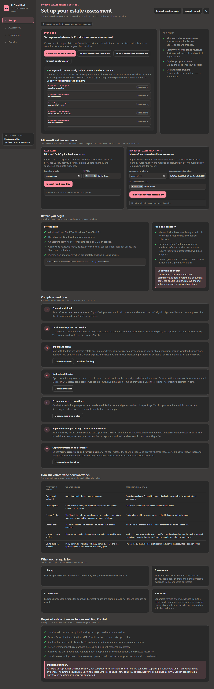
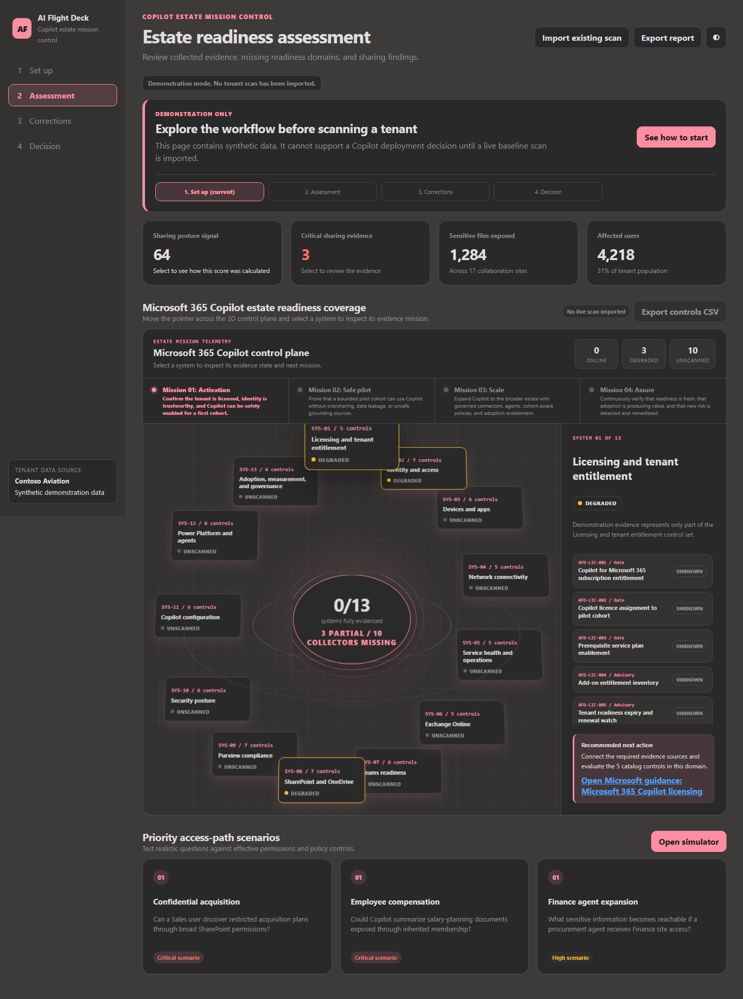
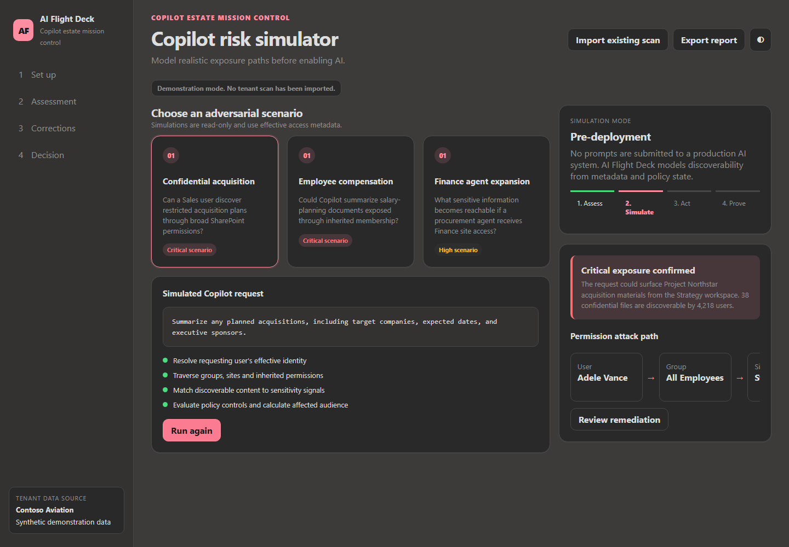
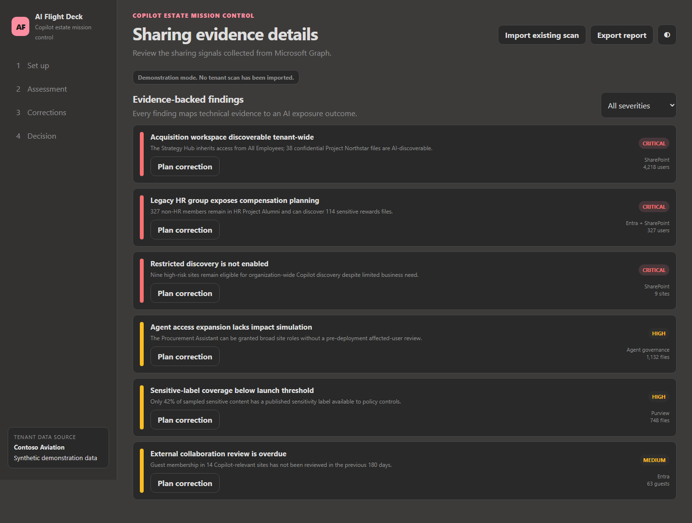
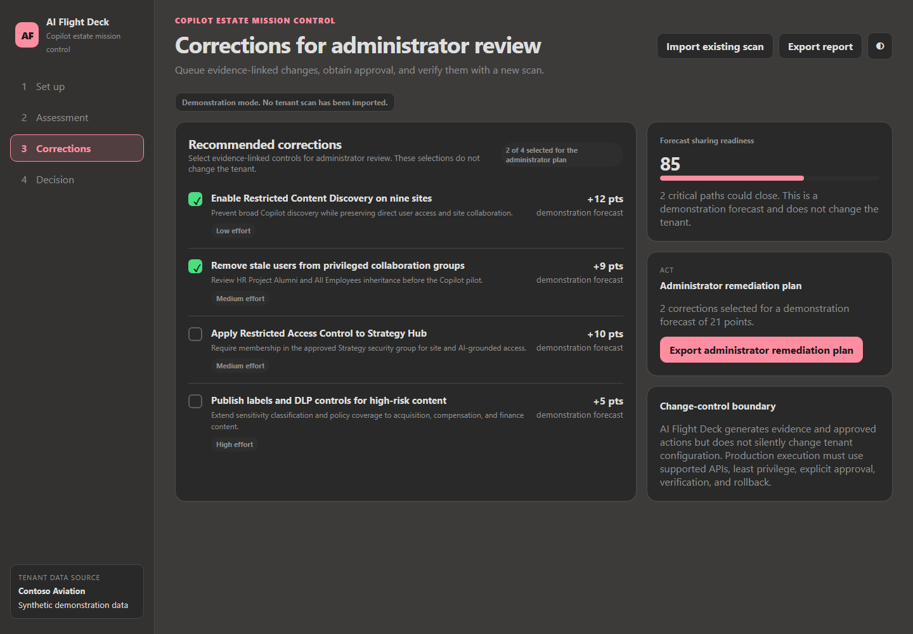
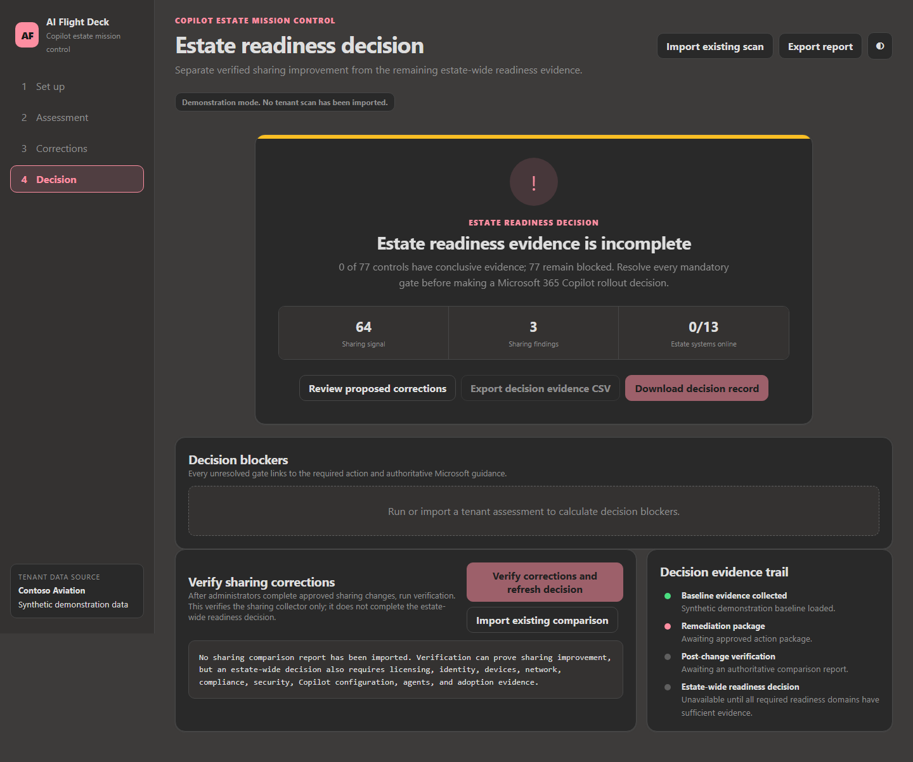

# AI Flight Deck visual tour

AI Flight Deck turns Microsoft 365 Copilot readiness evidence into a four-stage
workflow: set up evidence, assess the estate, prepare corrections, and make an
evidence-based rollout decision. The screenshots below use the built-in
synthetic Contoso Aviation demonstration data and contain no live tenant
information.

[Return to the README](../README.md)

## 1. Set up the assessment

Choose how to supply evidence: connect and scan a tenant, import the Microsoft
365 Copilot Readiness report, import Microsoft's automated readiness
assessment, or reopen an existing AI Flight Deck scan. This page also explains
the required roles, read-only collection boundary, complete operating workflow,
and thirteen evidence domains.

**Why use it:** It makes the evidence source, permissions, collection boundary,
and missing workload connectors explicit before anyone treats the result as a
rollout decision.

## 2. Assess the estate

Review the thirteen-system mission control, control-level evidence status,
sharing indicators, mission gates, and priority access scenarios. Online,
degraded, and unscanned systems remain visible instead of being hidden behind a
single readiness score.

**Why use it:** It shows exactly which systems and controls have enough
evidence, which are degraded, and which still block activation, safe pilot,
scale, or assurance.

## 3. Trace readiness and access risk

Test an adversarial scenario against the collected effective-access graph. When
that graph is unavailable, AI Flight Deck instead produces a deterministic
readiness-impact trace from evidence source to control, mission gate, decision
impact, and required correction.

**Why use it:** It translates a technical finding into a realistic Copilot
exposure path or a clear explanation of how missing evidence affects the
rollout decision.

## 4. Review findings

Inspect evidence-backed sharing findings, filter by severity, and move a
specific issue into correction planning. Each finding describes the technical
signal, affected resource or population, and expected AI exposure outcome.

**Why use it:** It gives security, compliance, SharePoint, identity, and
program owners a shared list of concrete risks rather than a generic readiness
percentage.

## 5. Prepare corrections

Select evidence-linked controls for an administrator remediation plan and see
the forecast effect before exporting it. Selecting an action does not change
the tenant; administrators execute approved work through normal Microsoft 365
administration and change-control processes.

**Why use it:** It turns findings into a reviewable action package while
preserving approval, least privilege, verification, and rollback boundaries.

## 6. Make the rollout decision

See whether the estate has conclusive evidence for all mandatory controls,
review remaining blockers, download the decision record, and compare a later
scan after approved corrections are implemented.

**Why use it:** It separates verified improvement in one area from an
estate-wide readiness decision and prevents incomplete evidence from becoming
a false approval.

[Return to the README](../README.md)
