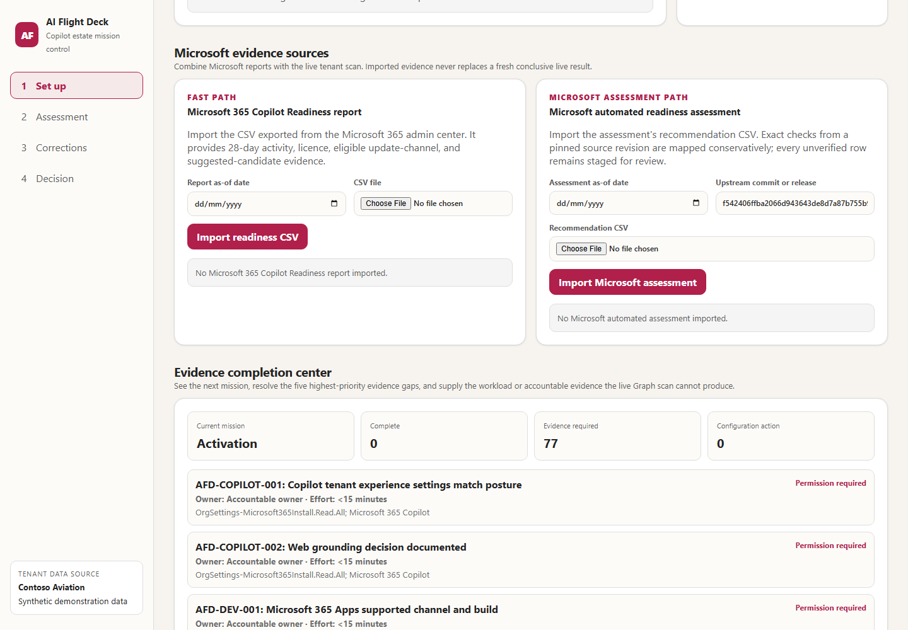
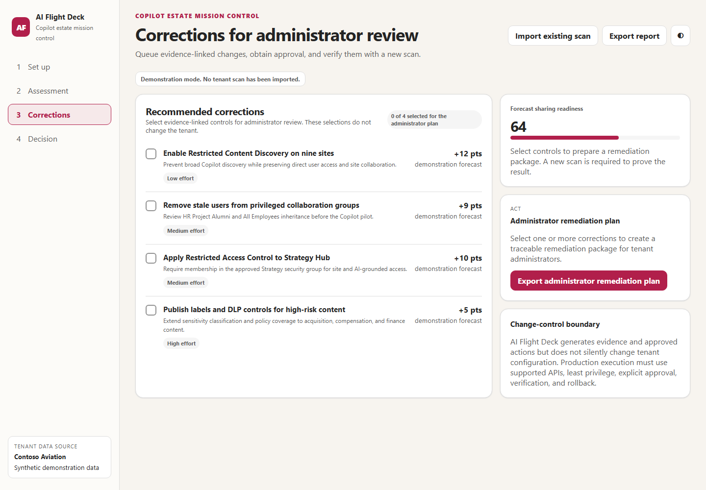
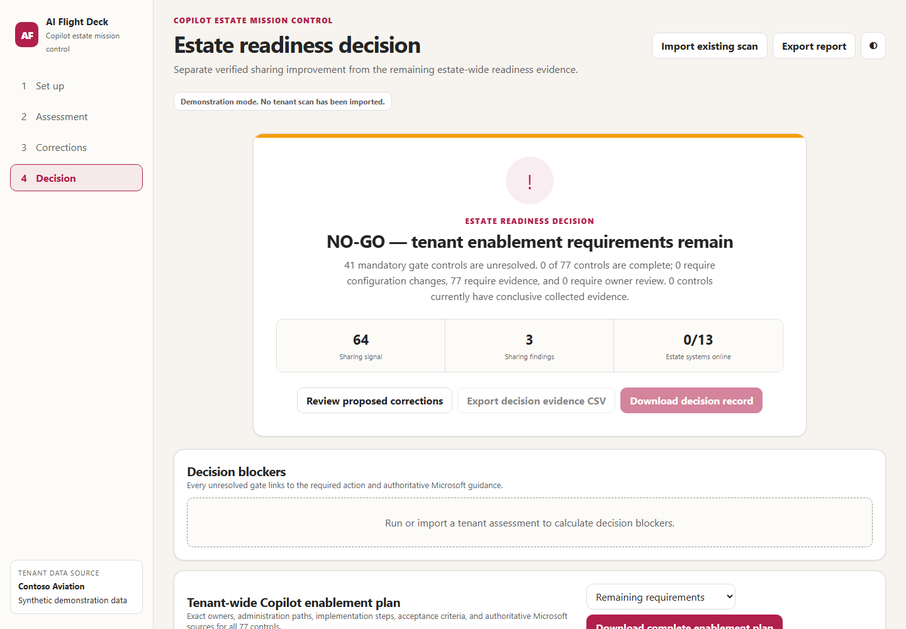

# AI Flight Deck visual tour

AI Flight Deck turns Microsoft 365 Copilot readiness evidence into a four-stage
workflow: set up the evidence, assess the estate, prepare corrections, and make
a cohort-specific rollout decision. The screenshots below use the built-in
synthetic demonstration data and contain no live tenant information.

[Return to the README](../README.md)

## 1. Set up the assessment and complete missing evidence

Start a read-only tenant scan, import an existing AI Flight Deck artifact, or
add evidence from Microsoft readiness reports. The Set up page explains the
permissions, collection boundaries, assessment domains, and operating
workflow.

The Evidence completion center identifies the current rollout mission and the
five highest-priority unresolved controls. Each blocker shows its evidence
state, accountable owner, estimated effort, missing requirement, and next
action.

Evidence that Microsoft Graph cannot collect can be supplied through
challenge-bound administrator packages, the Power Platform evidence contract,
or a locally sealed accountable attestation. Imported packages are checked for
tenant, producer, structure, freshness, and one-time challenge validity before
they can affect a control result.

**Why use it:** It provides one starting point for connecting the tenant,
understanding what evidence is missing, and routing each gap to the correct
administrator or accountable owner.

## 2. Assess the estate

Review readiness across 13 domains and 77 controls. The Assessment page keeps
incomplete, degraded, and unscanned areas visible rather than hiding them
behind a single score.

Open a domain or control to inspect its current status, evidence source,
collection time, coverage, limitations, ownership, and remediation guidance.
Evidence imported or attested on Set up is evaluated during the next scan and
then appears in these control-level results.

Assessment also includes evidence-backed findings and deterministic
readiness-impact traces. When an effective-access graph is available, the tool
can trace an access path. When it is unavailable, the tool explains how an
evidence gap affects a control, mission gate, decision, and required
correction.

**Why use it:** It shows what is known, what remains unproven, and which
controls block Activation, Safe pilot, Scale, or Assure for the approved
cohort.

## 3. Prepare corrections

Review evidence-linked technical corrections and model their expected effect
before exporting an action package. Selecting a correction creates a forecast
only; AI Flight Deck does not modify Microsoft 365 configuration.

Administrators implement approved changes through their normal Microsoft 365
administration and change-control processes. A new scan is then required to
prove the resulting state.

Evidence-collection tasks are prioritized in the Evidence completion center,
while this page focuses on technical configuration changes and remediation
forecasting.

**Why use it:** It separates a proposed change from verified evidence that the
change was implemented successfully.

## 4. Make the rollout decision

Review whether the explicitly approved cohort can proceed to its next rollout
mission. Missing permissions, incomplete coverage, stale evidence, invalid
exemptions, or unsupported evidence keep the relevant mission blocked.

The tenant enablement plan orders unresolved controls using the same evidence
priorities as the Evidence completion center. Every requirement provides
responsible roles, prerequisites, required outcome, implementation steps,
acceptance criteria, the next evidence action, and authoritative Microsoft
guidance.

The complete customer handoff can be downloaded as Markdown. After
administrators implement the required work, run another scan and return here
to evaluate the new evidence.

**Why use it:** It turns the assessment into a defensible, cohort-specific
decision and gives the customer an exact path from blocker to implementation
and proof of closure.

## How the stages connect

1. **Set up:** Connect or import evidence, identify the current mission, and
   complete missing evidence.
2. **Assessment:** Inspect detailed domain, control, trace, and finding
   results.
3. **Corrections:** Review proposed technical changes without modifying the
   tenant.
4. **Decision:** Follow the enablement plan, rescan, and determine whether the
   approved cohort can proceed.

[Return to the README](../README.md)
