# AI Flight Deck visual tour

> Guided action update: Corrections now saves action scope, local decisions,
> manual hand-off and completion history, then checks fresh supported evidence.
> See [Guided action workflow](ACTION-WORKFLOW.md) for the current steps.
> The screenshots below include the saved-action workflow and the distinction
> between a supported technical check and a reported but unverified hand-off.

This guide explains what each part of Flight Deck shows, what to do there, and
what the result means. Flight Deck helps organize a Copilot pilot assessment;
it does not enable Copilot, change Microsoft settings or approve a production
rollout on your behalf.

The application can use collected information to confirm three licensing checks
and one bounded Conditional Access baseline check,
and can accept written answers for eleven checks that require a person to
confirm the result. The other 62 checks do not yet have the software rules needed
to confirm their results. They can still show useful information and instructions.
Their presence on a page does not mean they have been completed.

All 16 screenshots were captured on **11 September 2026** to show the
then-current interface, revised Setup order and guided action workflow.
The **12 September** upgrade adds a suggested next action, expandable work
stages, no-JSON support/escalation forms and a complete pilot decision download;
see [the current workflow guide](ACTION-WORKFLOW.md).
Every image is labelled
as a synthetic example, not a real Microsoft 365 assessment. The examples
include incomplete collections and checks the app cannot yet confirm; they
are not demonstrations of a fully approved rollout.

[Return to the README](../README.md)

## Start here: what the terms mean

| Term you may see in a saved report or technical detail | Meaning |
|---|---|
| Tenant | Your organization's Microsoft 365 environment |
| Pilot or cohort | The people explicitly selected to try Copilot |
| Baseline | The first saved scan used as the starting point for comparison |
| Verification scan | A later collection used to compare with that starting point |
| Domain | A subject area such as licensing, email or SharePoint |
| Control | One Flight Deck readiness check, with an identifier such as `AFD-LIC-004` |
| Evidence | The setting, report, recorded observation or written answer used by a check |
| Attestation | A written answer from a responsible person, with supporting details and a review date |
| Mission or gate | A rollout stage and the checks Flight Deck requires before that stage can proceed |
| Unknown | The app cannot confirm a result; this is not the same as a failed Microsoft setting |

Flight Deck defines its own check identifiers and decision rules. They are not
Microsoft certification numbers. See the [connection guide](COLLECTOR-GUIDE.md)
for the Microsoft service, sign-in method and information read for each subject.

## 1. Set up the assessment

### Connect Microsoft 365 or load an existing assessment

For a first assessment, start the local service and choose **Connect and scan
tenant**. Sign in to the intended Microsoft 365 organization and complete the
requested approvals for read access. The app first reads Microsoft Graph
information, then attempts the Exchange, SharePoint, Purview and Power Platform
collections. These services may each ask you to sign in.

If you already have a saved Flight Deck assessment, load it instead. Microsoft
readiness CSV imports are optional additions, not a prerequisite for the normal
scan. Importing a report does not make its conclusions independently verified.

Read the scan limits before starting. A scan reads only the information the
signed-in account can access and stops at documented collection limits.
One failed service does not mean every service failed. Check each service's result.

[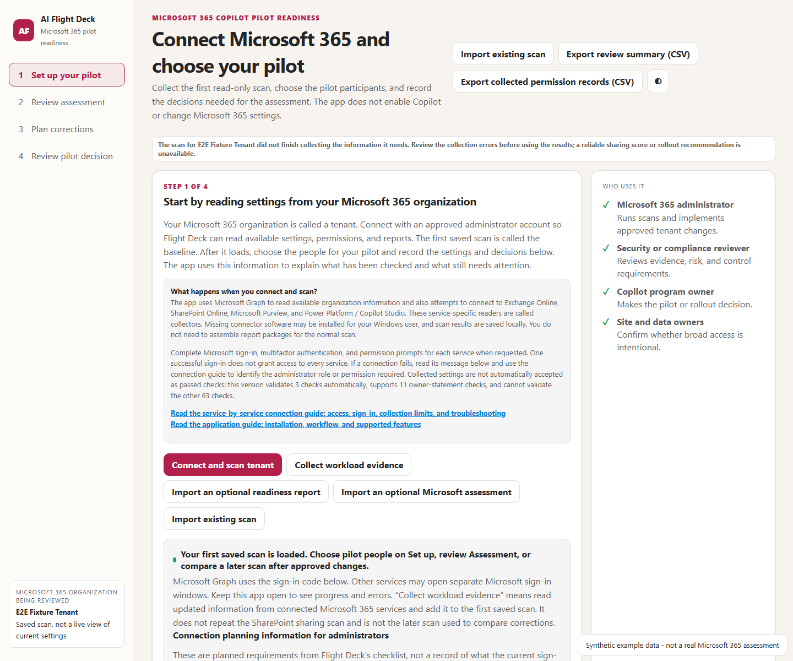](screenshots/01-setup-overview.png)

### Choose the people and settings for your pilot

After running or loading an assessment, use the pilot forms before working
through the list of unfinished checks. They record three things:

1. **Who will participate:** Search Microsoft Entra for users or groups, select
   the intended people, name the person or team responsible, tick the approval
   box and save. Everyone with a Copilot licence is not automatically your pilot.
2. **Whether an on-premises Exchange server is involved:** Ask the email
   administrator whether pilot users depend on an Exchange server operated by
   your organization as well as Exchange Online. Record the answer and how it
   was confirmed. Leave it unconfirmed if you do not know.
3. **Whether Copilot may use public-web information:** Confirm your intended
   policy with the responsible business or security owner, then record Allow
   or Restrict and the reason.

The saved participant list is a snapshot. Group membership does not update
automatically and recent directory changes may not appear immediately.
Saving these forms changes only the local Flight Deck records. It does not
assign licences, grant access, change the public-web setting, inspect an
on-premises server or send an approval request to the named owner.

[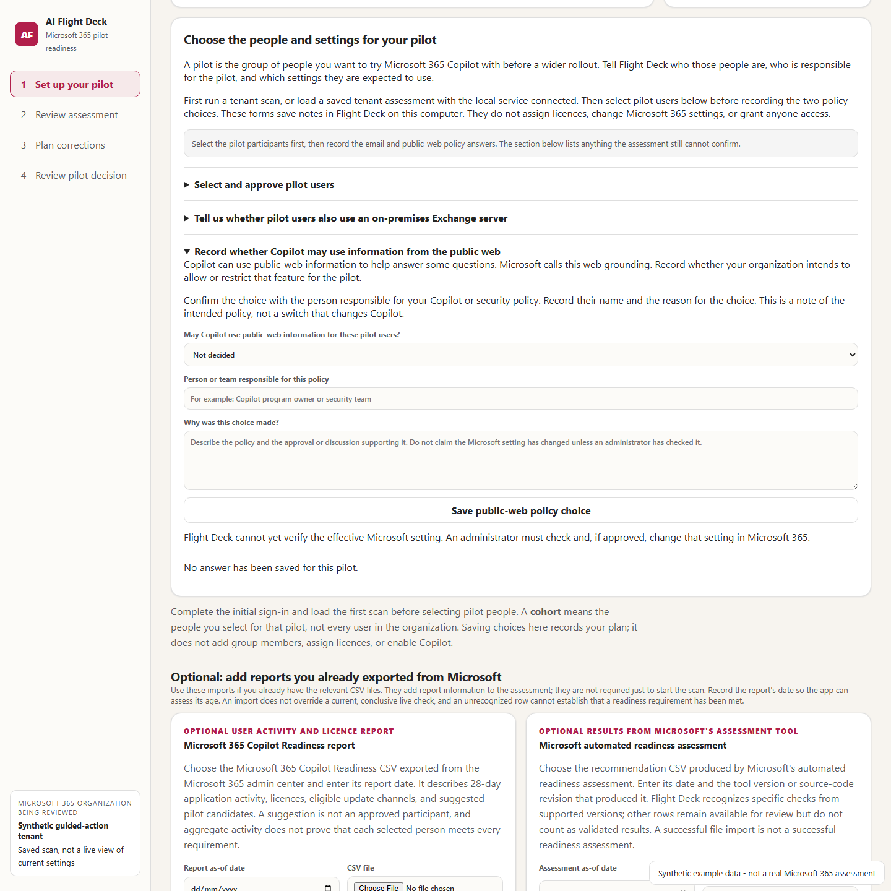](screenshots/14-setup-decisions.png)

### Work through what still needs to be checked

This section explains why the assessment is incomplete and who can take the
next step. It is not a list of 77 problems with your tenant.

| Category | What it means | What to do |
|---|---|---|
| Decisions for you | A participant list, policy answer or written confirmation is missing | Open the form, confirm the answer with the responsible person and save it |
| Help needed from an administrator | Required information could not be read, is too old, or needs licence/access confirmation | Read the specific reason and contact the administrator for that service; do not grant broad permissions blindly |
| Settings to review | The available information points to a setting that needs attention | Review it against your organization's requirements, obtain approval for any change, then collect new information |
| Checks this version cannot perform | Flight Deck is missing a connection or checking rule | Assess the requirement outside the tool; repeated scans and extra permissions do not add missing software |

Five items initially appear in each category. Use **Show more in this category**
to continue. Each item identifies the check, explains the next step and links to
the relevant form or instructions. A suggested contact is not an assigned task.
Technical errors are available separately for administrators and app maintainers.

### Collect workload evidence

Microsoft Graph does not expose every setting that the assessment needs.
Service-specific collection uses the relevant Microsoft administration tools
to read additional information.

Select **Connect and scan tenant**, or **Collect workload evidence** for an
existing baseline. The app prepares connectors, opens workload authentication,
runs Exchange Online, SharePoint Online, Purview and Power Platform / Copilot
Studio collection, and processes the results. No operator-run scripts or
hand-filled export packages are required.

Progress and errors appear separately for each service and are saved with the
assessment. Complete sign-in and multi-factor authentication when asked.
If a service reports a gap, read its explanation before retrying. For example,
an on-premises-only Exchange command cannot be made available simply by granting
an Exchange Online administrator role. A successful collection means data was
read, not that every readiness check passed.

For Power Platform, the app may collect apps and flows even when it cannot read
Copilot Studio agents from an environment's Dataverse database. Read the result
for each type of information, rather than assuming all collection succeeded or
all of it failed.

A row count of zero may mean the request succeeded and found no items, or that
the request failed. The status and error explain which happened. Rows returned
with warnings can remain available for investigation without being accepted as
reliable information for a readiness check.

Saved imports are checked for their organization, format, collection date and
whether they belong to the current collection. Rejected files cannot change a
readiness result simply by containing a "Pass" label.

[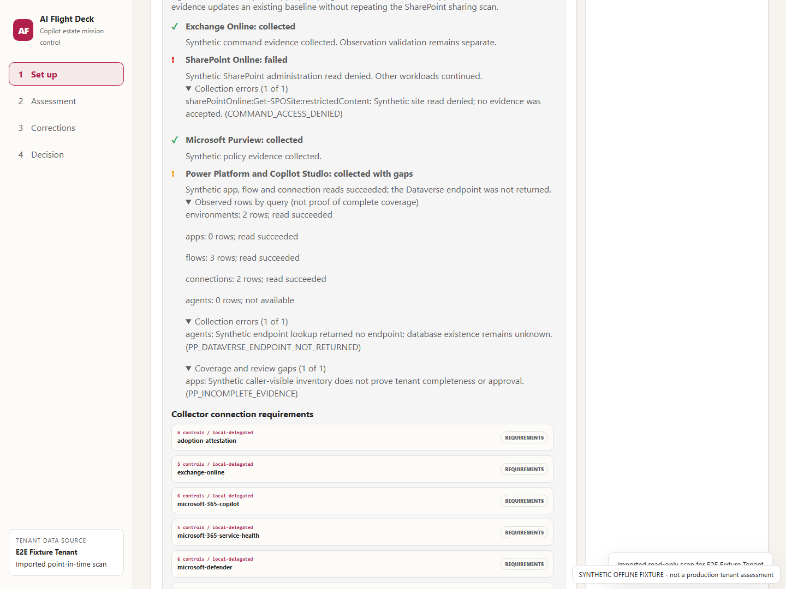](screenshots/03-setup-workload-evidence.png)

### Record a written answer from the responsible person

Some requirements concern work that software cannot establish on its own:
for example, whether training has been delivered or a use case has received
the required review. For supported checks, select the check in the written-answer
form, read its instructions, state what was confirmed, and fill in the example
supporting data. Add references to the documents that support the answer and
choose a date when the answer must be reviewed again.

This record is called an attestation. The app associates it with the signed-in
scan account, organization, pilot and check. Its local signature detects changes
to the saved record; it does not independently establish the truth of the answer
or the signer's approval authority. Save it and run another scan to evaluate it.
Only supported conditional checks can accept a justified "not applicable" answer;
this is not a way to skip any inconvenient check.

[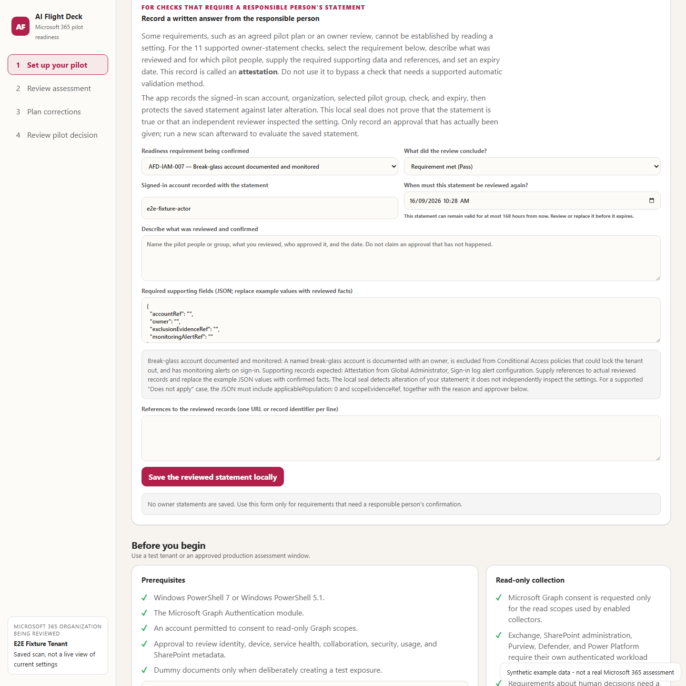](screenshots/04-setup-attestation.png)

### Understand what happens after collection

Use Assessment to read what was found. Use Corrections to prepare proposed
changes for an administrator. The administrator must obtain normal approval
and make changes outside Flight Deck. Then collect a later scan and compare it
with the first saved scan.

A predicted improvement is not a measured result. The tool can confirm a check
only when it has current information and the implemented rules for that check.
The complete real-tenant pilot-to-rollout process has not yet been demonstrated.

[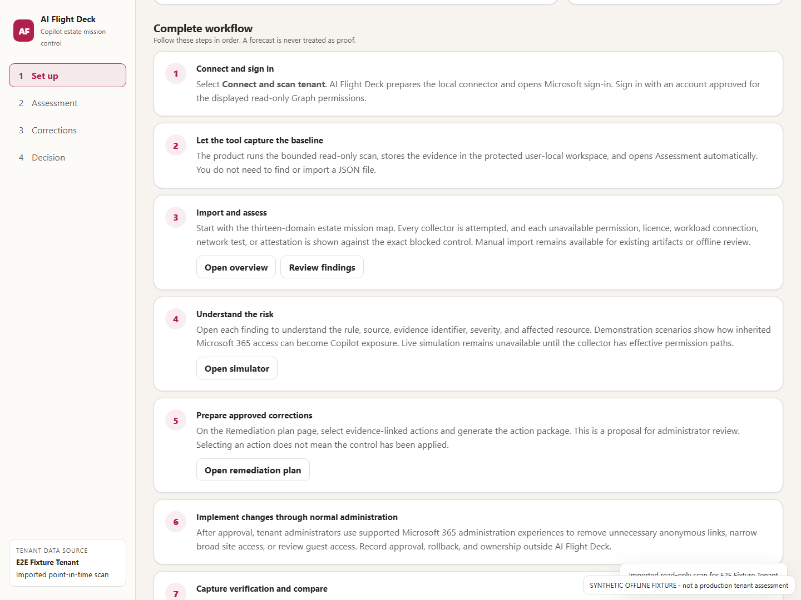](screenshots/05-setup-operating-workflow.png)

## 2. Read the assessment

### Review the readiness checks by subject

Start with a subject such as Licensing, Identity or SharePoint, then open a
specific check to read what it tests and why the result is incomplete or needs
review. There are 13 subject areas and 77 Flight Deck-defined checks. These
counts describe the checklist, not the number of automatically verified results.

For each check, read the result together with the collection date, the people
or resources covered and the explanation of missing information. Follow its
next-step instructions, rather than interpreting a grey or unknown result as a
misconfigured setting. New written answers are evaluated during the next scan.

[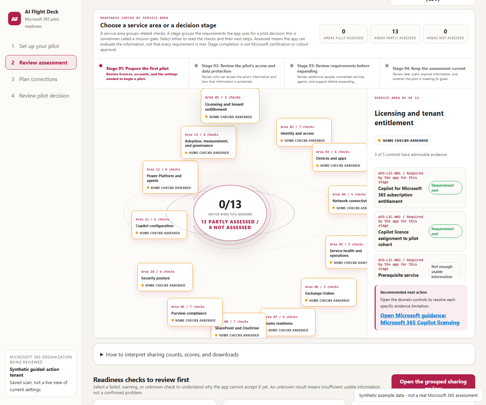](screenshots/06-assessment-control-plane.png)

### Review SharePoint access and sharing evidence

The live assessment names the resources it discovered instead of presenting
generic “access-path scenarios.” It can identify:

- SharePoint sites connected to public Microsoft 365 groups;
- sampled files and folders with Anyone links;
- sampled files and folders with organization-wide links;
- specific-people links and direct user, guest, group, application, or agent
  permissions when Graph returns bounded permission detail;
- inherited permissions on sampled shared items;
- guest-identity context that still requires a separate resource-access
  review; and
- which sites and items were sampled, and what was not inspected.

For each item, AI Flight Deck explains what was observed, why the sharing
configuration matters, the potential audience, what the scan did not prove,
and the administrator action required. Public sites are shown as SharePoint
sites. Files, folders, and sharing links retain their actual resource type.

The potential audience is an estimate, not a list of people who actually opened
the content. A public site or organization-wide link may reach people in the
organization; an Anyone link can be used by someone outside it who obtains the
link. Determining precisely who can access a particular resource needs additional
permission and group-membership checks.

If there is no usable sharing information, the app can instead explain how a
missing readiness check prevents a rollout-stage decision. This explanation is
not a test of someone's actual file access.

The example below contains no broad sharing result. It shows how the app
reports that absence without declaring that the whole organization is safe.

[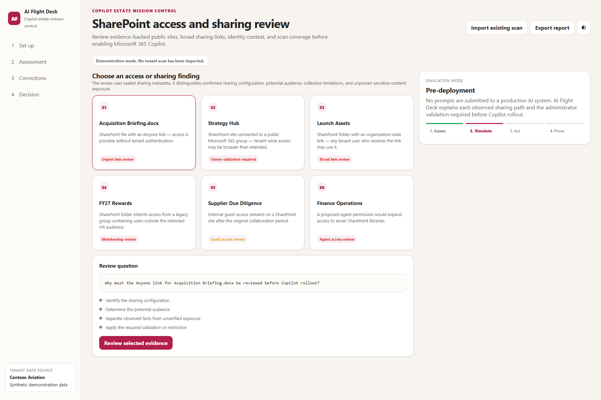](screenshots/07-assessment-sharing-review.png)

### Open a finding to understand the recommended review

Open an item to see which site, file or folder was observed, how access was
recorded, why it matters for Copilot and what the owner should review.
For example, an organization-wide sharing link may be appropriate for an
employee handbook but inappropriate for a confidential personnel file.
The scan does not inspect the file's contents or establish that sensitive
information was disclosed.

If the sample contains no public site or broad sharing link, the page says so
and still explains which files and sites were not inspected. It does not declare
the entire organization safe. If sharing details are unavailable, an explanation
of missing readiness information may appear instead; do not read that as an
actual file-permission test.

[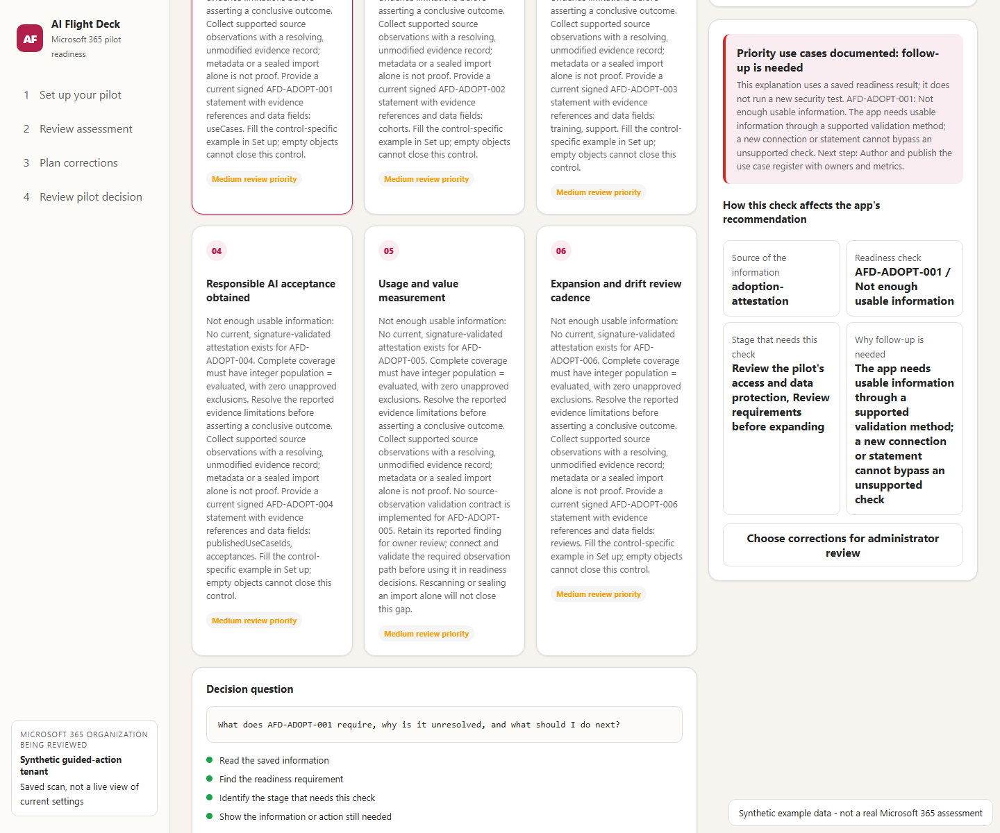](screenshots/08-assessment-sharing-result.png)

### Review grouped access evidence

The default view groups related permission records. Start with **Access that
needs a review** for broad, external or unclear access. **Other recorded
permissions** contains ordinary user and group access; it is not automatically
a list of changes to make.

One file can produce many permission records. A count of 4,000 permission
records therefore does not mean 4,000 files or 4,000 separate problems.
Inherited access means the file gets access from a parent folder, library or
site. The app says when the scan could not identify that parent.

Browse 25 groups per page and open a group for at most 50 records at a time.
The primary CSV is a grouped summary; the separate collected-evidence CSV
retains individual references without repeating the entire evidence list on
every row. These are sampled observations, not a complete tenant inventory.
The full bounded artifact still loads locally; UI pagination is not a
million-file backend.

[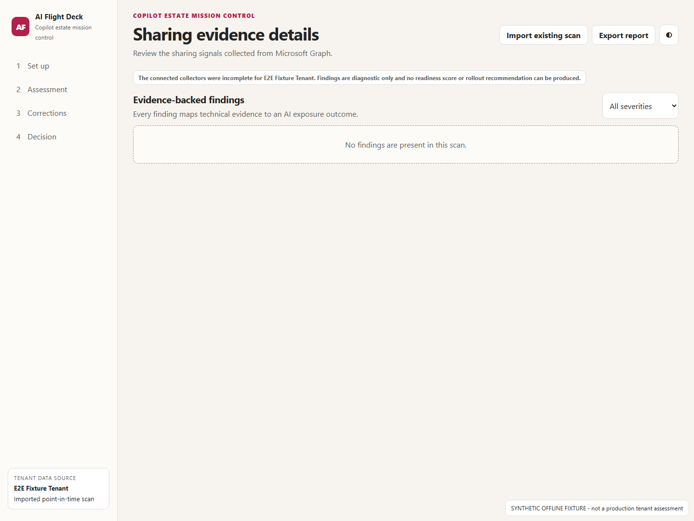](screenshots/09-assessment-findings.png)

## 3. Prepare corrections

Corrections now saves guided actions for the exact tenant/cohort snapshot.
Choose **Create or resume action**, record scope, owner/team, prerequisites and
any required user-recorded approval, then start the guided steps. Save progress,
preview a manual hand-off, and report completion before checking new evidence.
See [Guided action workflow](ACTION-WORKFLOW.md) for the full sequence.

The optional review-file export remains below these actions. Its selection
updates only the forecast; downloading a package does not send an approval
request or modify Microsoft 365.

Administrators obtain approval and implement changes through normal Microsoft
365 tools. Run another scan afterwards to see what changed in the information
the tool can collect. Missing information still appears in **What still needs
to be checked** on Set up. A guided action can record work for an unsupported
control, but no task completion or manual hand-off can provide its missing
technical verification contract.

The saved-action list shows separate work and verification results. In this
synthetic example, both actions have reported completion, but only the licensing
action has passed a supported technical check. The sharing action remains
unverified.

[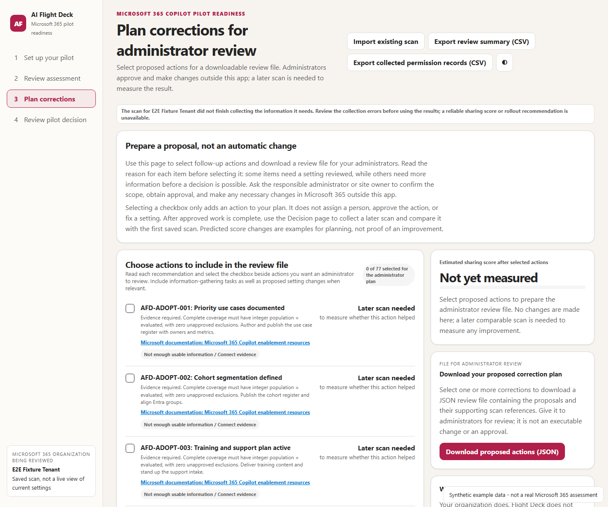](screenshots/10-corrections.png)

### Inspect what the technical check actually established

Open the action to review its original requirement, scope, owner and recorded
approval. A current, supported observation must be newer than reported
completion and match the exact assessment context. This licensing example
checks the cohort-wide assignment criterion; it does not prove who changed
assignments or that the whole tenant is ready.

[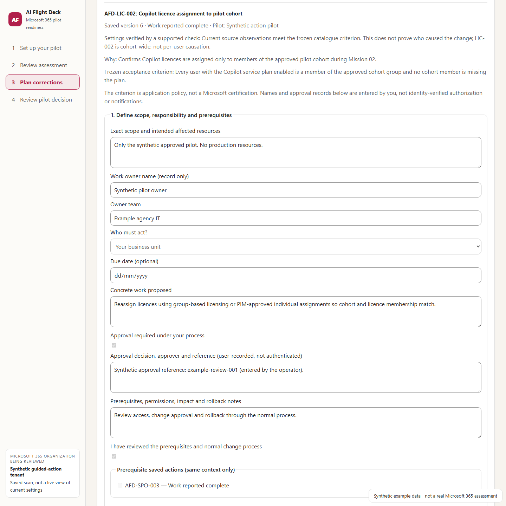](screenshots/15-guided-action-verification.png)

### Record a central-team hand-off without claiming technical proof

For work involving central IT, record the request, response and supporting
reference. Review the entire draft before copying it, then deliver it through
your approved process. The application does not send it or authenticate the
named approver. This example's sharing requirement has no supported technical
verification contract, so the recorded response does not mark it verified.

[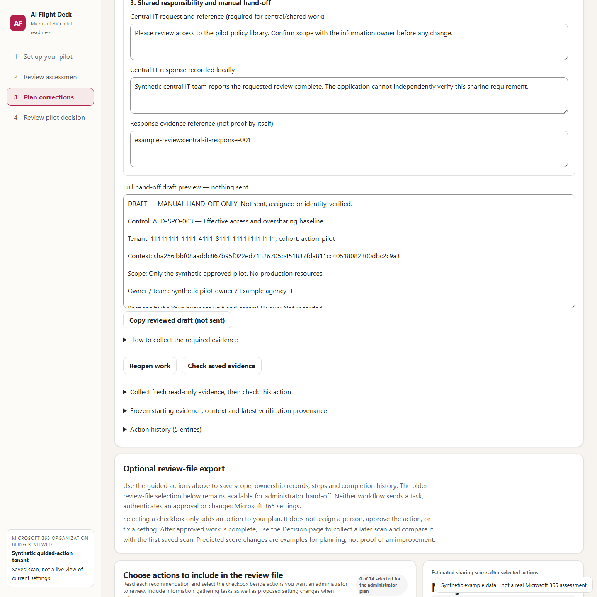](screenshots/16-guided-action-handoff.png)

## 4. Make the rollout decision

### Read the result for the selected pilot participants

Decision summarizes whether the selected pilot meets Flight Deck's rules for
the next rollout stage. Read the named pilot and scan date first so you know
which people and information the result covers. Then inspect the checks that
prevent a decision. A stage can remain blocked because the tool cannot check
something, even if the organization's actual configuration is acceptable.

A sharing sample with no broad links does not establish overall readiness.
The result is not Microsoft certification or permission to start a production
rollout. The program owner must make the actual decision using appropriate
organizational reviews and information beyond this prototype.

[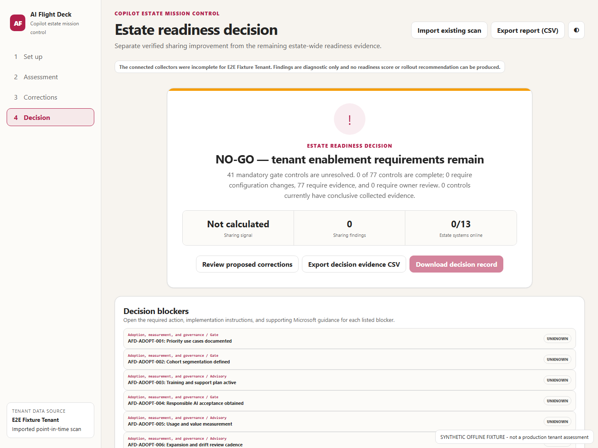](screenshots/11-decision-summary.png)

### Read the detailed instructions for each check

The detailed plan lists all 77 checks. Filter it to the items you need to review,
then expand a check. Its instructions identify suggested contacts, the relevant
administration page, what to examine, the desired result and supporting Microsoft
documentation. A suggested role is not a named assignee, and the tool has not
created a task for that person.

Read the requirement before asking someone to change a setting. Flight Deck's
thresholds and required checks are its own proposed rollout policy, not a
universal list of Microsoft prerequisites. Download the plan as Markdown to
share through your usual review process. Downloading it does not send it to
anyone or establish that a reviewer approved it.

[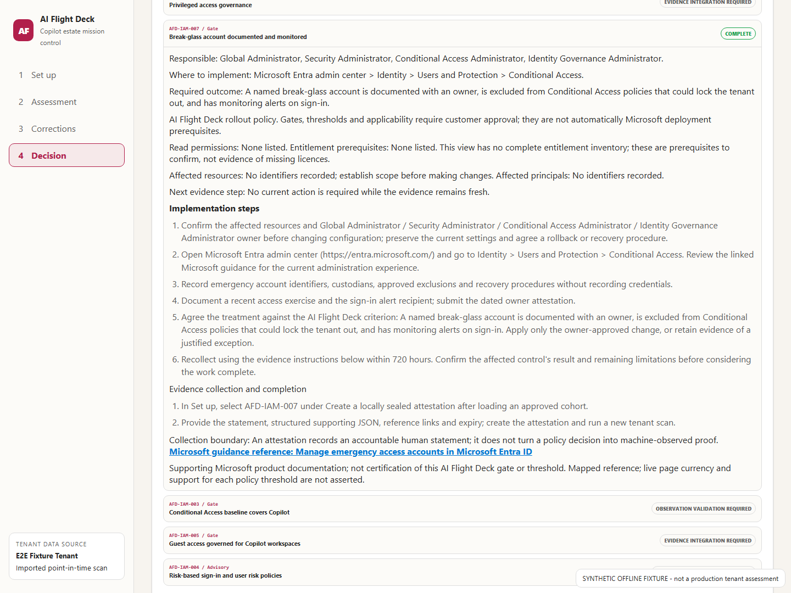](screenshots/12-decision-enablement-plan.png)

### Compare the earlier and later scans

After approved work is completed, run a later scan and return to Decision.
Read the dates and the collected coverage of both scans. The history separates
the first saved scan, imported reports, proposed changes and later observations.
Use it to explain which information supported the review, rather than treating
a selected proposal as a completed change.

Information that has passed its allowed age no longer satisfies a supported
check when the app reevaluates it. Later scans can also show changed results.
Flight Deck does not continuously watch Microsoft 365, automatically rescan,
send reminders or prove that every requirement has been resolved.

[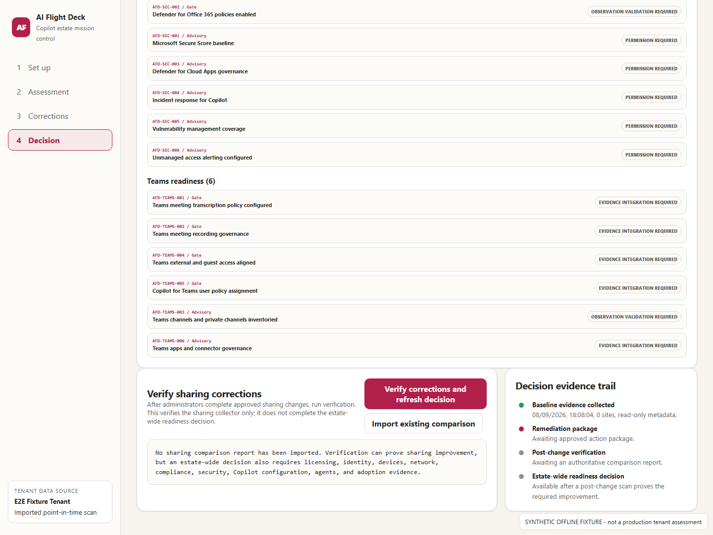](screenshots/13-decision-evidence-trail.png)

## How the stages connect

1. **Set up:** Connect the organization, collect information, select pilot users
   and answer the setup questions.
2. **Assessment:** Read the results and understand what the tool did and did not
   check.
3. **Corrections:** Prepare proposed changes for administrator review; nothing
   is applied to Microsoft 365 here.
4. **Decision:** Review what supports or prevents the pilot decision, compare
   later scans and retain the supporting records.

[Return to the README](../README.md)
